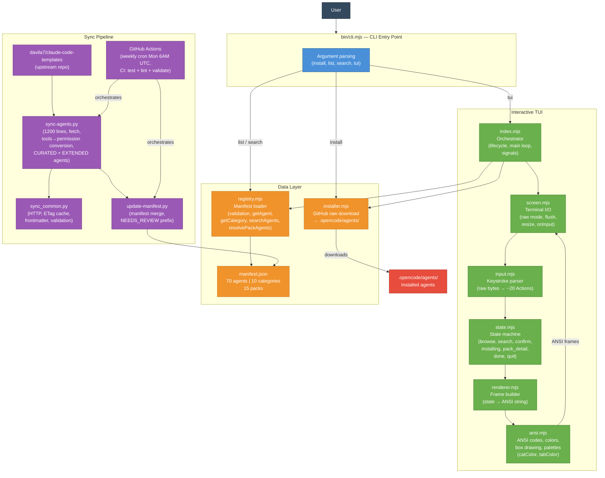

# opencode-agents

> 🇫🇷 [Version française](README.md)

[](https://github.com/dmicheneau/opencode-template-agent/actions/workflows/ci.yml)


Curated registry of **70 AI agents** for [OpenCode](https://opencode.ai), distributed via a zero-dependency CLI and interactive TUI. Agents are `.md` files containing system prompts that configure specialized AI assistants.

Source: [aitmpl.com](https://www.aitmpl.com/agents) (413+ agents available). The 4 primary agents are custom.

## 🚀 Quickstart

```bash
# Interactive TUI (auto-detects TTY)
npx github:dmicheneau/opencode-template-agent

# Quick CLI — install the backend pack
npx github:dmicheneau/opencode-template-agent install --pack backend
```

## 📦 Installation

### Mode 1 — Interactive TUI (recommended)

```bash
npx github:dmicheneau/opencode-template-agent
```

The CLI auto-detects whether the terminal supports TTY and launches the interactive TUI. You can also explicitly invoke it:

```bash
npx github:dmicheneau/opencode-template-agent tui
```

**What it does:**

- Browse categories with tabs (`← →` / `Tab`)
- Navigate agents with `↑ ↓`
- Select agents with `Space`, install with `Enter`
- Built-in search (`/`), packs, and categories

### Mode 2 — Non-interactive CLI

Agents are downloaded from GitHub and installed into `.opencode/agents/`. Requires Node.js 20+.

**Commands:**

```bash
# Install a specific agent
npx github:dmicheneau/opencode-template-agent install typescript-pro

# Install one or more packs (comma or space separated)
npx github:dmicheneau/opencode-template-agent install --pack backend
npx github:dmicheneau/opencode-template-agent install --pack backend,devops

# Install one or more categories
npx github:dmicheneau/opencode-template-agent install --category languages
npx github:dmicheneau/opencode-template-agent install --category languages,data-api

# Install all agents
npx github:dmicheneau/opencode-template-agent install --all

# List all agents by category
npx github:dmicheneau/opencode-template-agent list

# List available packs
npx github:dmicheneau/opencode-template-agent list --packs

# Search agents
npx github:dmicheneau/opencode-template-agent search docker
npx github:dmicheneau/opencode-template-agent search "machine learning"
```

**Options:**

| Option | Description |
|--------|-------------|
| `--force` | Overwrite existing agent files |
| `--dry-run` | Preview what would be installed without writing any files |

> **Note:** `--pack` and `--category` are mutually exclusive.

### Mode 3 — Bash script / Local clone

**Via bash script:**

```bash
curl -fsSL https://raw.githubusercontent.com/dmicheneau/opencode-template-agent/main/install.sh | bash
```

Options: `--copy`, `--global`, `--dir PATH`, `--force`, `--dry-run`, `--uninstall`.

**From a local clone:**

```bash
git clone https://github.com/dmicheneau/opencode-template-agent.git ~/.opencode-agents
echo 'export OPENCODE_CONFIG_DIR=~/.opencode-agents' >> ~/.zshrc
source ~/.zshrc
```

## 🏗️ Architecture

> Full documentation: [`docs/architecture.md`](docs/architecture.md)

### Global architecture



Two additional diagrams are available in [`docs/architecture.md`](docs/architecture.md):

- **TUI user flow** — state machine and transitions (browse → search → confirm → installing → done)
- **Agent update pipeline** — detailed 10-step GitHub Actions sync pipeline with security checks

## 📋 Available agents

70 agents — 4 primary (`Tab` in OpenCode) + 66 subagents (`@category/name`).

| Category | Agents | Description |
|----------|--------|-------------|
| 💻 Languages | 11 | TypeScript, Python, Go, Rust, Java, C#, PHP, Kotlin, C++, Rails, Swift |
| 🤖 AI | 9 | AI engineering, data science, ML, MLOps, LLM, prompts, research, data engineering, data analysis |
| 🌐 Web | 9 | React, Next.js, Vue, Angular, fullstack, mobile, UI design, UI analysis, accessibility |
| 🗄️ Data & API | 5 | API architecture, GraphQL, databases, PostgreSQL, Redis |
| ⚙️ DevOps | 10 | Docker, Kubernetes, Terraform, AWS, CI/CD, Linux, platform, SRE |
| 🛠️ DevTools | 8 | Code review, debugging, performance, refactoring, testing, orchestration, microservices, QA |
| 🔒 Security | 4 | Security audit, penetration testing, smart contracts, security engineering |
| 🔌 MCP | 4 | MCP protocol, servers, development, security audit |
| 📊 Business | 6 | Product management, project management, PRD, Scrum, UX research, business analysis |
| 📝 Docs | 4 | Technical documentation, API docs, writing, diagrams |

⭐ 4 primary agents (`Tab` in OpenCode): cloud-architect, devops-engineer, fullstack-developer, episode-orchestrator

## 🎒 Packs

15 predefined packs for installing coherent groups of agents.

| Pack | Agents | Description |
|------|--------|-------------|
| `backend` | postgres-pro, redis-specialist, database-architect, api-architect, python-pro, typescript-pro, debugger, test-automator | Backend stack |
| `frontend` | expert-react-frontend-engineer, expert-nextjs-developer, typescript-pro, ui-designer, performance-engineer, test-automator | Frontend stack |
| `devops` | devops-engineer, cloud-architect, docker-specialist, kubernetes-specialist, terraform-specialist, aws-specialist, ci-cd-engineer, linux-admin, platform-engineer | Infrastructure |
| `fullstack` | fullstack-developer, typescript-pro, expert-react-frontend-engineer, expert-nextjs-developer, postgres-pro, api-architect, debugger, test-automator, code-reviewer | Full stack |
| `ai` | ai-engineer, data-scientist, ml-engineer, llm-architect, prompt-engineer, search-specialist | AI & ML |
| `security` | security-auditor, penetration-tester, smart-contract-auditor | Security |
| `mcp` | mcp-protocol-specialist, mcp-server-architect, mcp-developer, mcp-security-auditor | MCP servers |
| `quality` | code-reviewer, test-automator, debugger, performance-engineer, refactoring-specialist | Code quality |
| `startup` | fullstack-developer, typescript-pro, expert-nextjs-developer, postgres-pro, docker-specialist, product-manager, ui-designer, test-automator | Startup kit |
| `data-stack` | data-engineer, data-analyst, data-scientist, database-architect, postgres-pro | Data stack |
| `ml-to-production` | data-scientist, ml-engineer, mlops-engineer, llm-architect, docker-specialist, kubernetes-specialist | ML to production |
| `frontend-complete` | expert-react-frontend-engineer, expert-nextjs-developer, vue-expert, angular-architect, accessibility, ui-designer | Complete frontend |
| `ship-it-safely` | ci-cd-engineer, docker-specialist, kubernetes-specialist, sre-engineer, security-engineer, qa-expert | Safe deployment |
| `product-discovery` | product-manager, ux-researcher, business-analyst, prd, ui-designer | Product discovery |
| `architecture-docs` | microservices-architect, api-architect, database-architect, diagram-architect, documentation-engineer | Architecture & docs |

## ⚙️ CI / CD

### Continuous integration (`ci.yml`)

Every push or pull request to `main` triggers 4 parallel jobs:

| Job | Description |
|-----|-------------|
| **test** | Python tests across 3 versions (3.10, 3.12, 3.13) |
| **test-cli** | Node.js tests across 3 versions (20, 22, 23) — CLI, TUI, lock |
| **lint** | Python/Node syntax, shellcheck, agent YAML frontmatter validation, manifest JSON validation |
| **validate-agents** | Verifies manifest consistency with actual files, detects deprecated fields |

### Dependency updates (`dependabot.yml`)

Dependabot monitors the SHA pins of GitHub Actions used in workflows and automatically opens a PR each week when an update is available. All actions are pinned by SHA for security.

## 🔄 Agent synchronization

Agents are sourced from [aitmpl.com](https://www.aitmpl.com/agents) but **manually curated** to ensure high quality. The automated weekly sync has been disabled — each agent goes through an expert rewriting process before integration.

### Why no automatic sync?

Upstream agents (~133 available) follow a generic format (capability lists, fictional metrics). Project agents follow an expert format (operational workflow, decision trees, quality gates, anti-patterns). The quality gap (3-4/10 vs 8-9/10) makes automated import counterproductive.

### Adding a new agent

1. **Discovery** — list available upstream agents:
   ```bash
   python3 scripts/sync-agents.py --list --tier=extended
   ```
2. **Evaluation** — verify the agent fills a gap not covered by the existing 70 agents
3. **Skeleton import** — use the sync in dry-run mode to get frontmatter and permissions:
   ```bash
   gh workflow run "Sync Agents" -f tier=core -f dry_run=true
   ```
4. **Rewriting** — rewrite the body using the project's template (Workflow → Decisions → Quality Gate → Anti-patterns → Collaboration)

### Available scripts

| Script | Description |
|--------|-------------|
| `scripts/sync-agents.py` | Downloads and converts agents from the upstream repo |
| `scripts/update-manifest.py` | Merges sync manifest with the main manifest |
| `scripts/sync_common.py` | Shared HTTP utilities, ETag cache, frontmatter validation |

## 🚀 Releases & Changelog

The changelog is automatically generated from Git history using [git-cliff](https://git-cliff.org), user-oriented with clear categories.

### How it works

1. **Tag push** — push a `v*` tag (e.g., `git tag v8.0.0 && git push --tags`)
2. **Changelog generation** — git-cliff analyzes commits since the last tag and generates a structured changelog
3. **GitHub Release** — a release is automatically created with the changelog as the body

### Changelog categories

| Commit prefix | Changelog category |
|---------------|-------------------|
| `feat` | ✨ New features |
| `fix` | 🐛 Bug fixes |
| `perf` | ⚡ Performance |
| `docs` | 📝 Documentation |
| `refactor` | ♻️ Refactoring |
| `chore`, `ci`, `build`, `style`, `test` | 🔧 Maintenance |

> Commits with `BREAKING CHANGE` are prefixed with **BREAKING:** in their respective category.

### Creating a release

```bash
# Bump version in package.json, tag and push
npm version major  # or minor, patch
git push --follow-tags

# Or manually
git tag v8.0.0
git push --tags
```

## 🧪 Tests

**870 tests** (559 JS + 311 Python).

```bash
# All JS tests (CLI + TUI)
node --test tests/cli.test.mjs tests/tui.test.mjs tests/lock.test.mjs

# All Python tests
python3 tests/run_tests.py

# Specific tests
python3 -m pytest tests/test_agents.py -v
python3 -m pytest tests/test_sync_script.py -v
python3 -m pytest tests/test_update_manifest.py -v
```

## 🤝 Contributing

Contributions are welcome! See the open [issues](https://github.com/dmicheneau/opencode-template-agent/issues).

Agents sourced from [aitmpl.com](https://www.aitmpl.com/agents) ([claude-code-templates](https://github.com/davila7/claude-code-templates)).

## 📄 License

MIT
