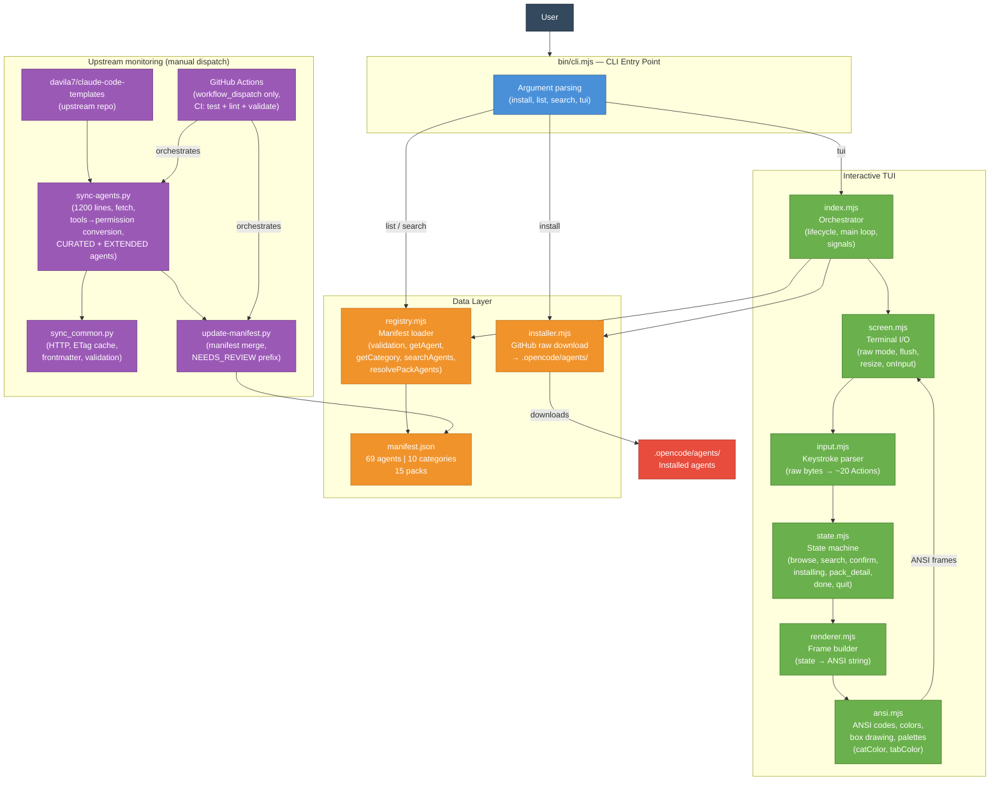

# opencode-agents

> 🇫🇷 [Version française](README.md)

[](https://github.com/dmicheneau/opencode-template-agent/actions/workflows/ci.yml)


Curated registry of **69 AI agents** for [OpenCode](https://opencode.ai), distributed via a zero-dependency CLI and interactive TUI. Agents are `.md` files containing system prompts that configure specialized AI assistants.

Each agent follows an expert 4-section format: identity, decisions, examples, quality gate.

---

## 🚀 Quickstart

```bash
# Interactive TUI (auto-detects TTY)
npx github:dmicheneau/opencode-template-agent

# Quick CLI — install a pack in one command
npx github:dmicheneau/opencode-template-agent install --pack backend
```

---

## 📦 Installation

### Mode 1 — Interactive TUI (recommended)

The TUI is the easiest way to discover and install agents. It launches automatically when the terminal supports TTY.

```bash
npx github:dmicheneau/opencode-template-agent
# or explicitly:
npx github:dmicheneau/opencode-template-agent tui
```

**What it does:**

- Auto-detects TTY and launches the interactive interface
- Browse categories with tabs (`←` `→` / `Tab`)
- Navigate lists with `↑` `↓`
- Select agents with `Space`, install with `Enter`
- Built-in search (`/`), pack and category browsing

### Mode 2 — Non-interactive CLI

For automation or quick installation without a graphical interface.

**Commands:**

```bash
# Install a specific agent
npx github:dmicheneau/opencode-template-agent install typescript-pro

# Install one or more packs (comma or space separated)
npx github:dmicheneau/opencode-template-agent install --pack backend
npx github:dmicheneau/opencode-template-agent install --pack backend,devops

# Install one or more categories
npx github:dmicheneau/opencode-template-agent install --category languages
npx github:dmicheneau/opencode-template-agent install --category languages,data-api

# Install all agents
npx github:dmicheneau/opencode-template-agent install --all

# List all agents by category
npx github:dmicheneau/opencode-template-agent list

# List available packs
npx github:dmicheneau/opencode-template-agent list --packs

# Search agents
npx github:dmicheneau/opencode-template-agent search docker
npx github:dmicheneau/opencode-template-agent search "machine learning"
```

**Options:**

| Option | Description |
|--------|-------------|
| `--force` | Overwrite existing files |
| `--dry-run` | Preview without writing to disk |

> **Note:** `--pack` and `--category` are mutually exclusive.

### Mode 3 — Bash script / Local clone

**Via bash script:**

```bash
curl -fsSL https://raw.githubusercontent.com/dmicheneau/opencode-template-agent/main/install.sh | bash
```

Options: `--copy`, `--global`, `--dir PATH`, `--force`, `--dry-run`, `--uninstall`.

**From a local clone:**

```bash
git clone https://github.com/dmicheneau/opencode-template-agent.git ~/.opencode-agents
echo 'export OPENCODE_CONFIG_DIR=~/.opencode-agents' >> ~/.zshrc
source ~/.zshrc
```

Agents are installed into `.opencode/agents/`. Node.js 20+ required for modes 1 and 2.

---

## 🏗️ Architecture

> Full documentation: [`docs/architecture.md`](docs/architecture.md)

The diagram below shows the overall system architecture: the CLI entry point, TUI modules, agent registry, and upstream monitoring scripts.



Two additional diagrams are available in [`docs/architecture.md`](docs/architecture.md):

- **TUI user flow** — complete state machine (browse, search, confirm, installing, done)
- **Agent update pipeline** — upstream monitoring scripts and discovery/evaluation workflow (manual dispatch only)

---

## 📋 Available agents

69 agents across 10 categories, invocable via `@category/name`.

| Category | Agents | Description |
|----------|--------|-------------|
| 💻 Languages | 11 | TypeScript, Python, Go, Rust, Java, C#, PHP, Kotlin, C++, Rails, Swift |
| 🤖 AI | 9 | AI engineering, data science, ML, MLOps, LLM, prompts, research, data engineering, data analysis |
| 🌐 Web | 9 | React, Next.js, Vue, Angular, mobile, UI design, UI analysis, accessibility, fullstack |
| 🗄️ Data & API | 6 | API architecture, GraphQL, databases, PostgreSQL, Redis, SQL |
| ⚙️ DevOps | 9 | Docker, Kubernetes, Terraform, AWS, CI/CD, Linux, platform, SRE, incident response |
| 🛠️ DevTools | 8 | Code review, debugging, performance, refactoring, testing, orchestration, microservices, QA, legacy modernization |
| 🔒 Security | 5 | Security audit, penetration testing, smart contracts, security engineering, compliance |
| 🔌 MCP | 2 | MCP development, MCP security audit |
| 📊 Business | 6 | Product management, project management, PRD, Scrum, UX research, business analysis |
| 📝 Docs | 4 | Technical documentation, API docs, writing, diagrams |

---

## 📊 Agent quality

Each agent is automatically scored by `scripts/quality_scorer.py` across **8 dimensions** (score 1–5 each):

| Dimension | What is measured | 5/5 |
|-----------|-----------------|-----|
| `frontmatter` | Presence of `description`, `mode`, `permission` | All 3 fields present |
| `identity` | Identity paragraph between the frontmatter and the first `##` | 50–300 words |
| `decisions` | `## Decisions` section with IF/THEN trees | ≥ 5 rules |
| `examples` | `## Examples` section with code blocks | ≥ 3 examples |
| `quality_gate` | `## Quality Gate` section with validation criteria | ≥ 5 criteria |
| `conciseness` | Line count (70–120 ideal) and filler phrase ratio | 70–120 lines, ≤ 3% filler |
| `no_banned_sections` | No legacy sections (Workflow, Tools, Anti-patterns, Collaboration) | 0 banned sections |
| `version_pinning` | Version and year references in the identity | Version + year present |

**Pass threshold**: average ≥ 3.5 AND no dimension < 2

**Labels**: Excellent (≥ 4.5) · Good (≥ 3.5) · Needs improvement (≥ 2.5) · Poor (< 2.5)

### Agent catalog
<!-- SCORES:BEGIN -->
**69 agents** · Average score: **4.59/5** · 100% pass rate · 49 Excellent, 20 Good

> Estimated token cost: `size in bytes / 4` (approximation for English + code content).

| Category | Agent | Score | Label | ~Tokens | Lines |
|----------|-------|-------|-------|---------|-------|
| ai | ai-engineer | 4.75 | Excellent | 1,164 | 113 |
| ai | data-analyst | 4.75 | Excellent | 1,088 | 102 |
| ai | data-engineer | 4.75 | Excellent | 1,180 | 106 |
| ai | data-scientist | 4.75 | Excellent | 1,218 | 108 |
| ai | llm-architect | 4.88 | Excellent | 1,353 | 125 |
| ai | ml-engineer | 4.75 | Excellent | 1,170 | 108 |
| ai | mlops-engineer | 4.75 | Excellent | 1,205 | 125 |
| ai | prompt-engineer | 4.75 | Excellent | 1,386 | 121 |
| ai | search-specialist | 4.62 | Excellent | 1,316 | 114 |
| business | business-analyst | 4.62 | Excellent | 1,260 | 104 |
| business | prd | 4.25 | Good | 1,407 | 74 |
| business | product-manager | 4.25 | Good | 1,043 | 85 |
| business | project-manager | 4.38 | Good | 1,174 | 89 |
| business | scrum-master | 4.25 | Good | 1,265 | 98 |
| business | ux-researcher | 4.25 | Good | 1,446 | 116 |
| data-api | api-architect | 4.75 | Excellent | 1,351 | 128 |
| data-api | database-architect | 4.50 | Excellent | 1,265 | 113 |
| data-api | graphql-architect | 4.88 | Excellent | 1,249 | 128 |
| data-api | postgres-pro | 4.50 | Excellent | 1,208 | 119 |
| data-api | redis-specialist | 4.88 | Excellent | 1,243 | 122 |
| data-api | sql-pro | 4.50 | Excellent | 2,136 | 165 |
| devops | aws-specialist | 4.88 | Excellent | 1,087 | 123 |
| devops | ci-cd-engineer | 4.62 | Excellent | 1,103 | 118 |
| devops | docker-specialist | 4.62 | Excellent | 1,089 | 130 |
| devops | incident-responder | 4.25 | Good | 2,112 | 182 |
| devops | kubernetes-specialist | 4.88 | Excellent | 1,111 | 136 |
| devops | linux-admin | 4.62 | Excellent | 1,044 | 127 |
| devops | platform-engineer | 4.88 | Excellent | 1,019 | 118 |
| devops | sre-engineer | 4.38 | Good | 1,157 | 122 |
| devops | terraform-specialist | 4.88 | Excellent | 1,242 | 139 |
| devtools | code-reviewer | 4.25 | Good | 1,214 | 110 |
| devtools | debugger | 4.25 | Good | 1,369 | 122 |
| devtools | legacy-modernizer | 4.25 | Good | 2,661 | 220 |
| devtools | microservices-architect | 4.50 | Excellent | 1,230 | 150 |
| devtools | performance-engineer | 4.25 | Good | 1,226 | 119 |
| devtools | qa-expert | 4.25 | Good | 1,267 | 123 |
| devtools | refactoring-specialist | 4.50 | Excellent | 1,753 | 186 |
| devtools | test-automator | 4.50 | Excellent | 1,546 | 161 |
| docs | api-documenter | 4.62 | Excellent | 1,195 | 118 |
| docs | diagram-architect | 4.62 | Excellent | 1,173 | 111 |
| docs | documentation-engineer | 4.38 | Good | 1,050 | 105 |
| docs | technical-writer | 4.25 | Good | 1,097 | 120 |
| languages | cpp-pro | 4.62 | Excellent | 1,096 | 120 |
| languages | csharp-developer | 4.62 | Excellent | 1,071 | 114 |
| languages | golang-pro | 4.88 | Excellent | 1,033 | 114 |
| languages | java-architect | 4.88 | Excellent | 1,282 | 117 |
| languages | kotlin-specialist | 4.88 | Excellent | 1,101 | 102 |
| languages | php-pro | 4.88 | Excellent | 1,102 | 119 |
| languages | python-pro | 4.88 | Excellent | 1,049 | 120 |
| languages | rails-expert | 4.88 | Excellent | 1,141 | 120 |
| languages | rust-pro | 4.88 | Excellent | 1,115 | 119 |
| languages | swift-expert | 4.88 | Excellent | 1,111 | 119 |
| languages | typescript-pro | 4.88 | Excellent | 1,148 | 107 |
| mcp | mcp-developer | 4.88 | Excellent | 1,384 | 125 |
| mcp | mcp-security-auditor | 4.12 | Good | 1,289 | 87 |
| security | compliance-auditor | 4.75 | Excellent | 1,805 | 107 |
| security | penetration-tester | 4.62 | Excellent | 1,828 | 137 |
| security | security-auditor | 4.25 | Good | 1,633 | 104 |
| security | security-engineer | 4.25 | Good | 1,111 | 109 |
| security | smart-contract-auditor | 4.75 | Excellent | 2,269 | 126 |
| web | accessibility | 4.50 | Excellent | 1,273 | 107 |
| web | angular-architect | 4.25 | Good | 1,282 | 125 |
| web | fullstack-developer | 4.62 | Excellent | 1,034 | 103 |
| web | mobile-developer | 4.50 | Excellent | 1,223 | 125 |
| web | nextjs-developer | 4.25 | Good | 1,201 | 126 |
| web | react-specialist | 4.88 | Excellent | 994 | 104 |
| web | screenshot-ui-analyzer | 4.25 | Good | 1,380 | 99 |
| web | ui-designer | 4.62 | Excellent | 1,131 | 103 |
| web | vue-expert | 4.88 | Excellent | 1,094 | 104 |

<!-- SCORES:END -->
---

## 🎒 Packs

15 predefined packs for installing coherent groups of agents in a single command.

| Pack | Agents | Description |
|------|--------|-------------|
| `backend` | postgres-pro, redis-specialist, database-architect, api-architect, python-pro, typescript-pro, debugger, test-automator | Backend stack |
| `frontend` | react-specialist, nextjs-developer, typescript-pro, ui-designer, performance-engineer, test-automator | Frontend stack |
| `devops` | docker-specialist, kubernetes-specialist, terraform-specialist, aws-specialist, ci-cd-engineer, linux-admin, platform-engineer, incident-responder | Infrastructure |
| `fullstack` | fullstack-developer, typescript-pro, react-specialist, nextjs-developer, postgres-pro, api-architect, debugger, test-automator, code-reviewer | Full stack |
| `ai` | ai-engineer, data-scientist, ml-engineer, llm-architect, prompt-engineer, search-specialist | AI & ML |
| `security` | security-auditor, penetration-tester, smart-contract-auditor, compliance-auditor | Security |
| `mcp` | mcp-developer, mcp-security-auditor | MCP servers |
| `quality` | code-reviewer, test-automator, debugger, performance-engineer, refactoring-specialist, legacy-modernizer | Code quality |
| `startup` | fullstack-developer, typescript-pro, nextjs-developer, postgres-pro, docker-specialist, product-manager, ui-designer, test-automator | Startup kit |
| `data-stack` | data-engineer, data-analyst, data-scientist, database-architect, postgres-pro, sql-pro | Data stack |
| `ml-to-production` | data-scientist, ml-engineer, mlops-engineer, llm-architect, docker-specialist, kubernetes-specialist | ML to production |
| `frontend-complete` | react-specialist, nextjs-developer, vue-expert, angular-architect, accessibility, ui-designer | Complete frontend |
| `ship-it-safely` | ci-cd-engineer, docker-specialist, kubernetes-specialist, sre-engineer, security-engineer, qa-expert | Safe deployment |
| `product-discovery` | product-manager, ux-researcher, business-analyst, prd, ui-designer | Product discovery |
| `architecture-docs` | microservices-architect, api-architect, database-architect, diagram-architect, documentation-engineer | Architecture & docs |

---

## ⚙️ CI / CD

### Continuous integration (`ci.yml`)

Every push or pull request to `main` triggers 4 parallel jobs:

| Job | Description |
|-----|-------------|
| **test** | Python tests across 3 versions (3.10, 3.12, 3.13) |
| **test-cli** | Node.js tests across 3 versions (20, 22, 23) — CLI, TUI, lock |
| **lint** | Python/Node syntax, shellcheck, agent YAML frontmatter validation, manifest JSON validation |
| **validate-agents** | Verifies manifest consistency with actual files, detects deprecated fields |

### Dependency updates (`dependabot.yml`)

Dependabot monitors the SHA pins of GitHub Actions used in workflows and automatically opens a PR each week when an update is available. All actions are pinned by SHA for security.

---

## 🔄 Agent synchronization

Agents come from two sources: the majority originates from [aitmpl.com](https://www.aitmpl.com/agents) ([claude-code-templates](https://github.com/davila7/claude-code-templates)), and some are original creations of this project (aws-specialist, ci-cd-engineer, docker-specialist, linux-admin, redis-specialist, mcp-security-auditor, prd, screenshot-ui-analyzer). All agents are **manually curated** and go through an expert rewriting process before integration — the automated weekly sync has been disabled to ensure high quality.

### Why no automatic sync?

Upstream agents (~133 available) follow a generic format (capability lists, fictional metrics). Project agents follow an expert 4-section format (identity, decisions, examples, quality gate). The quality gap (3-4/10 vs 8-9/10) makes automated import counterproductive.

### Adding a new agent

1. **Discovery** — list available upstream agents using the local script:
   ```bash
   python3 scripts/sync-agents.py --list --tier=extended
   ```
2. **Evaluation** — verify the agent fills a gap not covered by the existing 69 agents
3. **Upstream dry-run** — trigger the workflow in discovery mode to fetch frontmatter and permissions without modifying the repo:
   ```bash
   gh workflow run "Sync Agents" -f tier=core -f dry_run=true
   ```
4. **Rewriting** — rewrite the body using the project's template (Identity → Decisions → Examples → Quality Gate)

### Available scripts

> These scripts are for **manual use only** — there is no automated sync.

| Script | Description |
|--------|-------------|
| `scripts/sync-agents.py` | Downloads and converts agents from the upstream repo |
| `scripts/update-manifest.py` | Merges sync manifest with the main manifest |
| `scripts/sync_common.py` | Shared HTTP utilities, ETag cache, frontmatter validation |
| `scripts/generate_readme_scores.py` | Regenerates quality score tables in both READMEs. `--check` mode for CI verification. |

---

## 🚀 Releases & Changelog

The changelog is automatically generated from Git history using [git-cliff](https://git-cliff.org), user-oriented with clear categories.

### How it works

1. **Tag push** — push a `v*` tag (e.g., `git tag v8.0.0 && git push --tags`)
2. **Changelog generation** — git-cliff analyzes commits since the last tag and generates a structured changelog
3. **GitHub Release** — a release is automatically created with the changelog as the body

### Changelog categories

| Commit prefix | Changelog category |
|---------------|-------------------|
| `feat` | ✨ New features |
| `fix` | 🐛 Bug fixes |
| `perf` | ⚡ Performance |
| `docs` | 📝 Documentation |
| `refactor` | ♻️ Refactoring |
| `chore`, `ci`, `build`, `style`, `test` | 🔧 Maintenance |

> Commits with `BREAKING CHANGE` are prefixed with **BREAKING:** in their respective category.

### Creating a release

```bash
# Bump version in package.json, tag and push
npm version major  # or minor, patch
git push --follow-tags

# Or manually
git tag v8.0.0
git push --tags
```

---

## 🧪 Tests

**593 tests** (283 JS + 310 Python).

```bash
# All JS tests (CLI + TUI)
node --test tests/cli.test.mjs tests/tui.test.mjs tests/lock.test.mjs

# All Python tests
python3 tests/run_tests.py

# Specific tests
python3 -m pytest tests/test_agents.py -v
python3 -m pytest tests/test_sync_script.py -v
python3 -m pytest tests/test_update_manifest.py -v
```

---

## 🤝 Contributing

Contributions are welcome! See the open [issues](https://github.com/dmicheneau/opencode-template-agent/issues).

### Modify or add an agent

1. Create or edit the file in `agents/<category>/<name>.md`
2. Follow the 4-section template: Identity, Decisions, Examples, Quality Gate
3. Regenerate the README scores:
   ```bash
   python3 scripts/generate_readme_scores.py
   ```
4. Commit the agent files **and** the updated READMEs together
5. CI will automatically verify that scores are up to date

> **Tip**: run `python3 scripts/quality_scorer.py agents/<category>/<name>.md` to see the detailed score before updating the READMEs.

### Minimum quality

Each agent must meet the quality threshold: **average score ≥ 3.5** and **no dimension < 2**. See the [Agent quality](#-agent-quality) section for dimension details.

Agents primarily sourced from [aitmpl.com](https://www.aitmpl.com/agents) ([claude-code-templates](https://github.com/davila7/claude-code-templates)), with original project creations. All manually rewritten and curated.

---

## 📄 License

MIT
