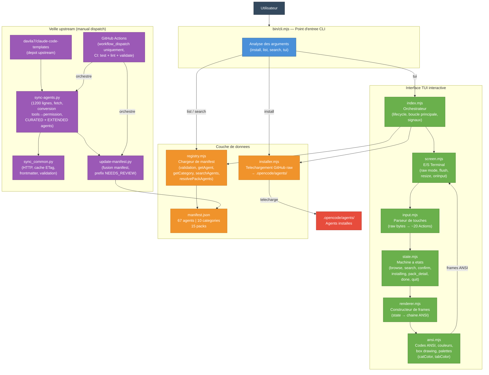

# opencode-agents

> 🇬🇧 [English version](README.en.md)

[](https://github.com/dmicheneau/opencode-template-agent/actions/workflows/ci.yml)


Registre curé de **67 agents IA** pour [OpenCode](https://opencode.ai), distribué via un CLI zero-dependency et un TUI interactif. Les agents sont des fichiers `.md` contenant des system prompts pour configurer des assistants IA spécialisés.

Source : [aitmpl.com](https://www.aitmpl.com/agents) (413+ agents disponibles). Les 4 agents primary sont custom.

---

## 🚀 Quickstart

```bash
# TUI interactif (auto-détecte TTY)
npx github:dmicheneau/opencode-template-agent

# CLI rapide — installer un pack en une commande
npx github:dmicheneau/opencode-template-agent install --pack backend
```

---

## 📦 Installation

### Mode 1 — TUI interactif (recommandé)

Le TUI est le moyen le plus simple de découvrir et installer des agents. Il se lance automatiquement lorsque le terminal supporte un TTY.

```bash
npx github:dmicheneau/opencode-template-agent
# ou explicitement :
npx github:dmicheneau/opencode-template-agent tui
```

**Ce que ça fait :**

- Auto-détecte le TTY et lance l'interface interactive
- Parcourir les catégories par onglets (`←` `→` / `Tab`)
- Naviguer dans les listes avec `↑` `↓`
- Sélectionner des agents avec `Space`, installer avec `Enter`
- Recherche intégrée (`/`), exploration par packs et catégories

### Mode 2 — CLI non-interactif

Pour l'automatisation ou une installation rapide sans interface graphique.

**Commandes :**

```bash
# Installer un agent spécifique
npx github:dmicheneau/opencode-template-agent install typescript-pro

# Installer un ou plusieurs packs (virgule ou espace)
npx github:dmicheneau/opencode-template-agent install --pack backend
npx github:dmicheneau/opencode-template-agent install --pack backend,devops

# Installer une ou plusieurs catégories
npx github:dmicheneau/opencode-template-agent install --category languages
npx github:dmicheneau/opencode-template-agent install --category languages,data-api

# Installer tous les agents
npx github:dmicheneau/opencode-template-agent install --all

# Lister tous les agents par catégorie
npx github:dmicheneau/opencode-template-agent list

# Lister les packs disponibles
npx github:dmicheneau/opencode-template-agent list --packs

# Rechercher des agents
npx github:dmicheneau/opencode-template-agent search docker
npx github:dmicheneau/opencode-template-agent search "machine learning"
```

**Options :**

| Option | Description |
|--------|-------------|
| `--force` | Écraser les fichiers existants |
| `--dry-run` | Aperçu sans écriture sur le disque |

> **Note :** `--pack` et `--category` sont mutuellement exclusifs.

### Mode 3 — Script bash / Clone local

**Via script bash :**

```bash
curl -fsSL https://raw.githubusercontent.com/dmicheneau/opencode-template-agent/main/install.sh | bash
```

Options : `--copy`, `--global`, `--dir PATH`, `--force`, `--dry-run`, `--uninstall`.

**Via clone local :**

```bash
git clone https://github.com/dmicheneau/opencode-template-agent.git ~/.opencode-agents
echo 'export OPENCODE_CONFIG_DIR=~/.opencode-agents' >> ~/.zshrc
source ~/.zshrc
```

Les agents sont installés dans `.opencode/agents/`. Node.js 20+ requis pour les modes 1 et 2.

---

## 🏗️ Architecture

> Documentation détaillée : [`docs/architecture.md`](docs/architecture.md)

Le diagramme ci-dessous présente l'architecture globale du système : le point d'entrée CLI, les modules TUI, le registre d'agents et les scripts de veille upstream.



Deux diagrammes supplémentaires sont disponibles dans [`docs/architecture.md`](docs/architecture.md) :

- **Flux utilisateur TUI** — machine à états complète (browse, search, confirm, installing, done)
- **Pipeline de mise à jour des agents** — scripts de veille upstream et workflow de découverte/évaluation (manual dispatch uniquement)

---

## 📋 Agents disponibles

67 agents — 4 primary (`Tab` dans OpenCode) + 63 subagents (`@catégorie/nom`).

| Catégorie | Agents | Description |
|-----------|--------|-------------|
| 💻 Languages | 11 | TypeScript, Python, Go, Rust, Java, C#, PHP, Kotlin, C++, Rails, Swift |
| 🤖 AI | 9 | AI engineering, data science, ML, MLOps, LLM, prompts, recherche, data engineering, data analysis |
| 🌐 Web | 9 | React, Next.js, Vue, Angular, fullstack, mobile, UI design, analyse UI, accessibilité |
| 🗄️ Data & API | 5 | Architecture API, GraphQL, bases de données, PostgreSQL, Redis |
| ⚙️ DevOps | 10 | Docker, Kubernetes, Terraform, AWS, CI/CD, Linux, plateforme, SRE |
| 🛠️ DevTools | 8 | Code review, debugging, performance, refactoring, tests, orchestration, microservices, QA |
| 🔒 Security | 4 | Audit sécurité, tests de pénétration, smart contracts, security engineering |
| 🔌 MCP | 4 | Protocole MCP, serveurs, développement, audit sécurité |
| 📊 Business | 6 | Product management, project management, PRD, Scrum, UX research, business analysis |
| 📝 Docs | 4 | Documentation technique, API, rédaction, diagrammes |

> ⭐ **4 agents primary** (`Tab` dans OpenCode) : `cloud-architect`, `devops-engineer`, `fullstack-developer`, `episode-orchestrator`

---

## 🎒 Packs

15 packs prédéfinis pour installer des groupes d'agents cohérents en une seule commande.

| Pack | Agents | Description |
|------|--------|-------------|
| `backend` | postgres-pro, redis-specialist, database-architect, api-architect, python-pro, typescript-pro, debugger, test-automator | Stack backend |
| `frontend` | expert-react-frontend-engineer, expert-nextjs-developer, typescript-pro, ui-designer, performance-engineer, test-automator | Stack frontend |
| `devops` | devops-engineer, cloud-architect, docker-specialist, kubernetes-specialist, terraform-specialist, aws-specialist, ci-cd-engineer, linux-admin, platform-engineer | Infrastructure |
| `fullstack` | fullstack-developer, typescript-pro, expert-react-frontend-engineer, expert-nextjs-developer, postgres-pro, api-architect, debugger, test-automator, code-reviewer | Full stack |
| `ai` | ai-engineer, data-scientist, ml-engineer, llm-architect, prompt-engineer, search-specialist | IA & ML |
| `security` | security-auditor, penetration-tester, smart-contract-auditor | Sécurité |
| `mcp` | mcp-protocol-specialist, mcp-server-architect, mcp-developer, mcp-security-auditor | MCP servers |
| `quality` | code-reviewer, test-automator, debugger, performance-engineer, refactoring-specialist | Qualité code |
| `startup` | fullstack-developer, typescript-pro, expert-nextjs-developer, postgres-pro, docker-specialist, product-manager, ui-designer, test-automator | Kit startup |
| `data-stack` | data-engineer, data-analyst, data-scientist, database-architect, postgres-pro | Stack données |
| `ml-to-production` | data-scientist, ml-engineer, mlops-engineer, llm-architect, docker-specialist, kubernetes-specialist | ML en production |
| `frontend-complete` | expert-react-frontend-engineer, expert-nextjs-developer, vue-expert, angular-architect, accessibility, ui-designer | Frontend complet |
| `ship-it-safely` | ci-cd-engineer, docker-specialist, kubernetes-specialist, sre-engineer, security-engineer, qa-expert | Déploiement sûr |
| `product-discovery` | product-manager, ux-researcher, business-analyst, prd, ui-designer | Découverte produit |
| `architecture-docs` | microservices-architect, api-architect, database-architect, diagram-architect, documentation-engineer | Architecture & docs |

---

## ⚙️ CI / CD

### Intégration continue (`ci.yml`)

Chaque push ou pull request sur `main` déclenche 4 jobs en parallèle :

| Job | Description |
|-----|-------------|
| **test** | Tests Python sur 3 versions (3.10, 3.12, 3.13) |
| **test-cli** | Tests Node.js sur 3 versions (20, 22, 23) — CLI, TUI, lock |
| **lint** | Syntaxe Python/Node, shellcheck, validation du frontmatter YAML des agents, validation du manifest JSON |
| **validate-agents** | Vérifie la cohérence du manifest avec les fichiers réels, détecte les champs dépréciés |

### Mises à jour des dépendances (`dependabot.yml`)

Dependabot surveille les SHA des GitHub Actions utilisées dans les workflows et ouvre automatiquement une PR chaque semaine si une mise à jour est disponible. Toutes les actions sont pinnées par SHA pour des raisons de sécurité.

---

## 🔄 Synchronisation des agents

Les agents sont sourcés depuis [aitmpl.com](https://www.aitmpl.com/agents) mais **curés manuellement** pour garantir un haut niveau de qualité. La synchronisation automatique hebdomadaire a été désactivée — chaque agent passe par un processus de réécriture experte avant intégration.

### Pourquoi pas de sync automatique ?

Les agents upstream (~133 disponibles) suivent un format générique (listes de compétences, métriques fictives). Les agents du projet suivent un format expert (workflow opérationnel, arbres de décision, quality gates, anti-patterns). La différence de qualité (3-4/10 vs 8-9/10) rend l'import automatique contre-productif.

### Ajouter un nouvel agent

1. **Découverte** — lister les agents upstream disponibles via le script local :
   ```bash
   python3 scripts/sync-agents.py --list --tier=extended
   ```
2. **Évaluation** — vérifier que l'agent apporte une compétence non couverte par les 67 agents existants
3. **Dry-run upstream** — lancer le workflow en mode discovery pour récupérer le frontmatter et les permissions sans modifier le repo :
   ```bash
   gh workflow run "Sync Agents" -f tier=core -f dry_run=true
   ```
4. **Réécriture** — réécrire le body avec le template du projet (Workflow → Décisions → Quality Gate → Anti-patterns → Collaboration)

### Scripts disponibles

> Ces scripts sont destinés à un usage **manuel** uniquement — il n'y a pas de synchronisation automatique.

| Script | Description |
|--------|-------------|
| `scripts/sync-agents.py` | Télécharge et convertit les agents depuis le dépôt upstream |
| `scripts/update-manifest.py` | Fusionne le manifest de sync dans le manifest principal |
| `scripts/sync_common.py` | Utilitaires HTTP partagés, cache ETag, validation de frontmatter |

---

## 🚀 Releases & Changelog

Le changelog est généré automatiquement à partir de l'historique Git via [git-cliff](https://git-cliff.org), orienté utilisateur avec des catégories claires.

### Fonctionnement

1. **Tag push** — pousser un tag `v*` (ex: `git tag v8.0.0 && git push --tags`)
2. **Génération du changelog** — git-cliff analyse les commits depuis le dernier tag et génère un changelog structuré
3. **GitHub Release** — une release est créée automatiquement avec le changelog comme corps

### Catégories du changelog

| Préfixe commit | Catégorie changelog |
|----------------|---------------------|
| `feat` | ✨ Nouveautés |
| `fix` | 🐛 Corrections |
| `perf` | ⚡ Performance |
| `docs` | 📝 Documentation |
| `refactor` | ♻️ Refactoring |
| `chore`, `ci`, `build`, `style`, `test` | 🔧 Maintenance |

> Les commits avec `BREAKING CHANGE` sont préfixés **BREAKING:** dans leur catégorie respective.

### Créer une release

```bash
# Bumper la version dans package.json, tagger et pousser
npm version major  # ou minor, patch
git push --follow-tags

# Ou manuellement
git tag v8.0.0
git push --tags
```

---

## 🧪 Tests

**870 tests** (559 JS + 311 Python).

```bash
# Tous les tests JS (CLI + TUI)
node --test tests/cli.test.mjs tests/tui.test.mjs tests/lock.test.mjs

# Tous les tests Python
python3 tests/run_tests.py

# Tests spécifiques
python3 -m pytest tests/test_agents.py -v
python3 -m pytest tests/test_sync_script.py -v
python3 -m pytest tests/test_update_manifest.py -v
```

---

## 🤝 Contribuer

Les contributions sont les bienvenues ! Voir les [issues](https://github.com/dmicheneau/opencode-template-agent/issues) ouvertes.

Agents sourcés depuis [aitmpl.com](https://www.aitmpl.com/agents) ([claude-code-templates](https://github.com/davila7/claude-code-templates)).

---

## 📄 Licence

MIT
