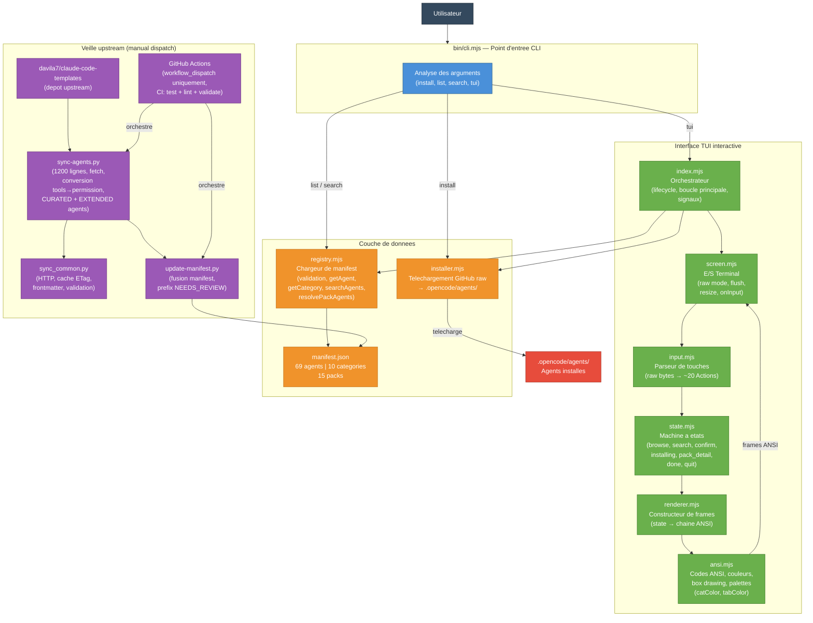

# opencode-agents

> 🇬🇧 [English version](README.en.md)

[](https://github.com/dmicheneau/opencode-template-agent/actions/workflows/ci.yml)


Registre curé de **69 agents IA** pour [OpenCode](https://opencode.ai), distribué via un CLI zero-dependency et un TUI interactif. Les agents sont des fichiers `.md` contenant des system prompts pour configurer des assistants IA spécialisés.

Chaque agent suit un format expert à 4 sections : identité, décisions, exemples, quality gate.

---

## 🚀 Quickstart

```bash
# TUI interactif (auto-détecte TTY)
npx github:dmicheneau/opencode-template-agent

# CLI rapide — installer un pack en une commande
npx github:dmicheneau/opencode-template-agent install --pack backend
```

---

## 📦 Installation

### Mode 1 — TUI interactif (recommandé)

Le TUI est le moyen le plus simple de découvrir et installer des agents. Il se lance automatiquement lorsque le terminal supporte un TTY.

```bash
npx github:dmicheneau/opencode-template-agent
# ou explicitement :
npx github:dmicheneau/opencode-template-agent tui
```

**Ce que ça fait :**

- Auto-détecte le TTY et lance l'interface interactive
- Parcourir les catégories par onglets (`←` `→` / `Tab`)
- Naviguer dans les listes avec `↑` `↓`
- Sélectionner des agents avec `Space`, installer avec `Enter`
- Recherche intégrée (`/`), exploration par packs et catégories

### Mode 2 — CLI non-interactif

Pour l'automatisation ou une installation rapide sans interface graphique.

**Commandes :**

```bash
# Installer un agent spécifique
npx github:dmicheneau/opencode-template-agent install typescript-pro

# Installer un ou plusieurs packs (virgule ou espace)
npx github:dmicheneau/opencode-template-agent install --pack backend
npx github:dmicheneau/opencode-template-agent install --pack backend,devops

# Installer une ou plusieurs catégories
npx github:dmicheneau/opencode-template-agent install --category languages
npx github:dmicheneau/opencode-template-agent install --category languages,data-api

# Installer tous les agents
npx github:dmicheneau/opencode-template-agent install --all

# Lister tous les agents par catégorie
npx github:dmicheneau/opencode-template-agent list

# Lister les packs disponibles
npx github:dmicheneau/opencode-template-agent list --packs

# Rechercher des agents
npx github:dmicheneau/opencode-template-agent search docker
npx github:dmicheneau/opencode-template-agent search "machine learning"
```

**Options :**

| Option | Description |
|--------|-------------|
| `--force` | Écraser les fichiers existants |
| `--dry-run` | Aperçu sans écriture sur le disque |

> **Note :** `--pack` et `--category` sont mutuellement exclusifs.

### Mode 3 — Script bash / Clone local

**Via script bash :**

```bash
curl -fsSL https://raw.githubusercontent.com/dmicheneau/opencode-template-agent/main/install.sh | bash
```

Options : `--copy`, `--global`, `--dir PATH`, `--force`, `--dry-run`, `--uninstall`.

**Via clone local :**

```bash
git clone https://github.com/dmicheneau/opencode-template-agent.git ~/.opencode-agents
echo 'export OPENCODE_CONFIG_DIR=~/.opencode-agents' >> ~/.zshrc
source ~/.zshrc
```

Les agents sont installés dans `.opencode/agents/`. Node.js 20+ requis pour les modes 1 et 2.

---

## 🔌 Plugin OpenCode

Le plugin expose le registre des 69 agents comme **outils LLM** directement dans les sessions [OpenCode](https://opencode.ai). Version actuelle : **discovery-only (v1)** — 4 tools en lecture seule, aucune modification du système de fichiers.

### Installation

**Globale** (recommandé — disponible dans toutes les sessions OpenCode) :

Ajouter dans `~/.config/opencode/opencode.json` :

```json
{
  "plugin": ["github:dmicheneau/opencode-template-agent"]
}
```

**Par projet** (disponible uniquement dans le projet concerné) :

Ajouter dans `.opencode/opencode.json` à la racine du projet :

```json
{
  "plugin": ["github:dmicheneau/opencode-template-agent"]
}
```

### Tools disponibles

| Tool | Description |
|------|-------------|
| `search_agents` | Recherche par nom, description, catégorie ou tags |
| `list_agents` | Liste tous les agents groupés par catégorie, avec filtres optionnels par catégorie ou pack |
| `get_agent` | Détails complets d'un agent (description, mode d'installation, état d'installation, suggestions de correction si typo) |
| `check_health` | Rapport de santé du registre (agents installés, obsolètes, manquants, intégrité) |

### Exemples d'utilisation

```
> Cherche un agent pour TypeScript
> Liste les agents de la catégorie security
> Vérifie la santé du registre
```

### Structure des fichiers

```
plugin/
  index.ts       # point d'entrée (exporté comme Plugin OpenCode)
  tools.ts       # définitions des 4 tools
  types.d.ts     # déclarations de types
```

> **Prérequis** : [OpenCode](https://opencode.ai) + [Bun](https://bun.sh) (le TypeScript est transpilé nativement, pas d'étape de build).

---

## 🏗️ Architecture

> Documentation détaillée : [`docs/architecture.md`](docs/architecture.md)

Le diagramme ci-dessous présente l'architecture globale du système : le point d'entrée CLI, les modules TUI, le registre d'agents et les scripts de veille upstream.


```mermaid
flowchart TB
    User["Utilisateur"]

    subgraph CLI["bin/cli.mjs — Point d'entree CLI"]
        Parse["Analyse des arguments<br/>(install, list, search, tui)"]
    end

    subgraph TUI["Interface TUI interactive"]
        Index["index.mjs<br/>Orchestrateur<br/>(lifecycle, boucle principale,<br/>signaux)"]
        Screen["screen.mjs<br/>E/S Terminal<br/>(raw mode, flush,<br/>resize, onInput)"]
        Input["input.mjs<br/>Parseur de touches<br/>(raw bytes → ~20 Actions)"]
        State["state.mjs<br/>Machine a etats<br/>(browse, search, confirm,<br/>installing, pack_detail,<br/>done, quit)"]
        Renderer["renderer.mjs<br/>Constructeur de frames<br/>(state → chaine ANSI)"]
        Ansi["ansi.mjs<br/>Codes ANSI, couleurs,<br/>box drawing, palettes<br/>(catColor, tabColor)"]
    end

    subgraph Data["Couche de donnees"]
        Registry["registry.mjs<br/>Chargeur de manifest<br/>(validation, getAgent,<br/>getCategory, searchAgents,<br/>resolvePackAgents)"]
        Manifest["manifest.json<br/>69 agents | 10 categories<br/>15 packs"]
        Installer["installer.mjs<br/>Telechargement GitHub raw<br/>→ .opencode/agents/"]
    end

    subgraph Sync["Veille upstream (manual dispatch)"]
        Upstream["davila7/claude-code-templates<br/>(depot upstream)"]
        SyncScript["sync-agents.py<br/>(1200 lignes, fetch,<br/>conversion tools→permission,<br/>CURATED + EXTENDED agents)"]
        SyncCommon["sync_common.py<br/>(HTTP, cache ETag,<br/>frontmatter, validation)"]
        UpdateManifest["update-manifest.py<br/>(fusion manifest,<br/>prefix NEEDS_REVIEW)"]
        GHA["GitHub Actions<br/>(workflow_dispatch uniquement,<br/>CI: test + lint + validate)"]
    end

    LocalDir[".opencode/agents/<br/>Agents installes"]

    User --> CLI
    Parse -->|"tui"| Index
    Parse -->|"install"| Installer
    Parse -->|"list / search"| Registry

    Index --> Screen
    Screen --> Input
    Input --> State
    State --> Renderer
    Renderer --> Ansi
    Ansi -->|"frames ANSI"| Screen

    Index --> Registry
    Index --> Installer
    Registry --> Manifest
    Installer -->|"telecharge"| LocalDir

    Upstream --> SyncScript
    SyncScript --> SyncCommon
    SyncScript --> UpdateManifest
    UpdateManifest --> Manifest
    GHA -->|"orchestre"| SyncScript
    GHA -->|"orchestre"| UpdateManifest

    classDef entrypoint fill:#4a90d9,stroke:#2c5f8a,color:#fff
    classDef tui fill:#6ab04c,stroke:#3d7a28,color:#fff
    classDef data fill:#f0932b,stroke:#c0741e,color:#fff
    classDef sync fill:#9b59b6,stroke:#6c3483,color:#fff
    classDef storage fill:#e74c3c,stroke:#a93226,color:#fff
    classDef user fill:#34495e,stroke:#1c2833,color:#fff

    class User user
    class Parse entrypoint
    class Index,Screen,Input,State,Renderer,Ansi tui
    class Registry,Manifest,Installer data
    class Upstream,SyncScript,SyncCommon,UpdateManifest,GHA sync
    class LocalDir storage
```

Deux diagrammes supplémentaires sont disponibles dans [`docs/architecture.md`](docs/architecture.md) :

- **Flux utilisateur TUI** — machine à états complète (browse, search, confirm, installing, done)
- **Pipeline de mise à jour des agents** — scripts de veille upstream et workflow de découverte/évaluation (manual dispatch uniquement)

---

## 📋 Agents disponibles

69 agents répartis en 10 catégories, invocables via `@catégorie/nom`.

| Catégorie | Agents | Description |
|-----------|--------|-------------|
| 💻 Languages | 11 | TypeScript, Python, Go, Rust, Java, C#, PHP, Kotlin, C++, Rails, Swift |
| 🤖 AI | 9 | AI engineering, data science, ML, MLOps, LLM, prompts, recherche, data engineering, data analysis |
| 🌐 Web | 9 | React, Next.js, Vue, Angular, mobile, UI design, analyse UI, accessibilité, fullstack |
| 🗄️ Data & API | 6 | Architecture API, GraphQL, bases de données, PostgreSQL, Redis, SQL |
| ⚙️ DevOps | 9 | Docker, Kubernetes, Terraform, AWS, CI/CD, Linux, plateforme, SRE, incident response |
| 🛠️ DevTools | 8 | Code review, debugging, performance, refactoring, tests, orchestration, microservices, QA, legacy modernization |
| 🔒 Security | 5 | Audit sécurité, tests de pénétration, smart contracts, security engineering, conformité |
| 🔌 MCP | 2 | Développement MCP, audit sécurité MCP |
| 📊 Business | 6 | Product management, project management, PRD, Scrum, UX research, business analysis |
| 📝 Docs | 4 | Documentation technique, API, rédaction, diagrammes |

---

## 📊 Qualité des agents

Chaque agent est évalué automatiquement par `scripts/quality_scorer.py` sur **8 dimensions** (score 1-5 chacune) :

| Dimension | Ce qui est mesuré | 5/5 |
|-----------|-------------------|-----|
| `frontmatter` | Présence de `description`, `mode`, `permission` | 3 champs présents |
| `identity` | Paragraphe d'identité entre le frontmatter et le premier `##` | 50-300 mots |
| `decisions` | Section `## Decisions` avec arbres IF/THEN | ≥ 5 règles |
| `examples` | Section `## Examples` avec blocs de code | ≥ 3 exemples |
| `quality_gate` | Section `## Quality Gate` avec critères de validation | ≥ 5 critères |
| `conciseness` | Nombre de lignes (70-120 idéal) et ratio de filler phrases | 70-120 lignes, ≤ 3% filler |
| `no_banned_sections` | Absence des anciennes sections (Workflow, Tools, Anti-patterns, Collaboration) | 0 section interdite |
| `version_pinning` | Références à des versions et années dans l'identité | Version + année présents |

**Seuil de passage** : moyenne ≥ 3.5 ET aucune dimension < 2

**Labels** : Excellent (≥ 4.5) · Good (≥ 3.5) · Needs improvement (≥ 2.5) · Poor (< 2.5)

### Catalogue des agents
<!-- SCORES:BEGIN -->
**69 agents** · Score moyen : **4.59/5** · 100% pass rate · 49 Excellent, 20 Good

> Coût token estimé : `taille en bytes / 4` (approximation pour contenu anglais + code).

| Catégorie | Agent | Score | Label | ~Tokens | Lignes |
|-----------|-------|-------|-------|---------|--------|
| ai | ai-engineer | 4.75 | Excellent | 1 164 | 113 |
| ai | data-analyst | 4.75 | Excellent | 1 088 | 102 |
| ai | data-engineer | 4.75 | Excellent | 1 180 | 106 |
| ai | data-scientist | 4.75 | Excellent | 1 218 | 108 |
| ai | llm-architect | 4.88 | Excellent | 1 353 | 125 |
| ai | ml-engineer | 4.75 | Excellent | 1 170 | 108 |
| ai | mlops-engineer | 4.75 | Excellent | 1 205 | 125 |
| ai | prompt-engineer | 4.75 | Excellent | 1 386 | 121 |
| ai | search-specialist | 4.62 | Excellent | 1 316 | 114 |
| business | business-analyst | 4.62 | Excellent | 1 260 | 104 |
| business | prd | 4.25 | Good | 1 407 | 74 |
| business | product-manager | 4.25 | Good | 1 043 | 85 |
| business | project-manager | 4.38 | Good | 1 174 | 89 |
| business | scrum-master | 4.25 | Good | 1 265 | 98 |
| business | ux-researcher | 4.25 | Good | 1 446 | 116 |
| data-api | api-architect | 4.75 | Excellent | 1 351 | 128 |
| data-api | database-architect | 4.50 | Excellent | 1 265 | 113 |
| data-api | graphql-architect | 4.88 | Excellent | 1 249 | 128 |
| data-api | postgres-pro | 4.50 | Excellent | 1 208 | 119 |
| data-api | redis-specialist | 4.88 | Excellent | 1 243 | 122 |
| data-api | sql-pro | 4.50 | Excellent | 2 136 | 165 |
| devops | aws-specialist | 4.88 | Excellent | 1 087 | 123 |
| devops | ci-cd-engineer | 4.62 | Excellent | 1 103 | 118 |
| devops | docker-specialist | 4.62 | Excellent | 1 089 | 130 |
| devops | incident-responder | 4.25 | Good | 2 112 | 182 |
| devops | kubernetes-specialist | 4.88 | Excellent | 1 111 | 136 |
| devops | linux-admin | 4.62 | Excellent | 1 044 | 127 |
| devops | platform-engineer | 4.88 | Excellent | 1 019 | 118 |
| devops | sre-engineer | 4.38 | Good | 1 157 | 122 |
| devops | terraform-specialist | 4.88 | Excellent | 1 242 | 139 |
| devtools | code-reviewer | 4.25 | Good | 1 214 | 110 |
| devtools | debugger | 4.25 | Good | 1 369 | 122 |
| devtools | legacy-modernizer | 4.25 | Good | 2 661 | 220 |
| devtools | microservices-architect | 4.50 | Excellent | 1 230 | 150 |
| devtools | performance-engineer | 4.25 | Good | 1 226 | 119 |
| devtools | qa-expert | 4.25 | Good | 1 267 | 123 |
| devtools | refactoring-specialist | 4.50 | Excellent | 1 753 | 186 |
| devtools | test-automator | 4.50 | Excellent | 1 546 | 161 |
| docs | api-documenter | 4.62 | Excellent | 1 195 | 118 |
| docs | diagram-architect | 4.62 | Excellent | 1 173 | 111 |
| docs | documentation-engineer | 4.38 | Good | 1 050 | 105 |
| docs | technical-writer | 4.25 | Good | 1 097 | 120 |
| languages | cpp-pro | 4.62 | Excellent | 1 096 | 120 |
| languages | csharp-developer | 4.62 | Excellent | 1 071 | 114 |
| languages | golang-pro | 4.88 | Excellent | 1 033 | 114 |
| languages | java-architect | 4.88 | Excellent | 1 282 | 117 |
| languages | kotlin-specialist | 4.88 | Excellent | 1 101 | 102 |
| languages | php-pro | 4.88 | Excellent | 1 102 | 119 |
| languages | python-pro | 4.88 | Excellent | 1 049 | 120 |
| languages | rails-expert | 4.88 | Excellent | 1 141 | 120 |
| languages | rust-pro | 4.88 | Excellent | 1 115 | 119 |
| languages | swift-expert | 4.88 | Excellent | 1 111 | 119 |
| languages | typescript-pro | 4.88 | Excellent | 1 148 | 107 |
| mcp | mcp-developer | 4.88 | Excellent | 1 384 | 125 |
| mcp | mcp-security-auditor | 4.12 | Good | 1 289 | 87 |
| security | compliance-auditor | 4.75 | Excellent | 1 805 | 107 |
| security | penetration-tester | 4.62 | Excellent | 1 828 | 137 |
| security | security-auditor | 4.25 | Good | 1 633 | 104 |
| security | security-engineer | 4.25 | Good | 1 111 | 109 |
| security | smart-contract-auditor | 4.75 | Excellent | 2 269 | 126 |
| web | accessibility | 4.50 | Excellent | 1 273 | 107 |
| web | angular-architect | 4.25 | Good | 1 282 | 125 |
| web | fullstack-developer | 4.62 | Excellent | 1 034 | 103 |
| web | mobile-developer | 4.50 | Excellent | 1 223 | 125 |
| web | nextjs-developer | 4.25 | Good | 1 201 | 126 |
| web | react-specialist | 4.88 | Excellent | 994 | 104 |
| web | screenshot-ui-analyzer | 4.25 | Good | 1 380 | 99 |
| web | ui-designer | 4.62 | Excellent | 1 131 | 103 |
| web | vue-expert | 4.88 | Excellent | 1 094 | 104 |

<!-- SCORES:END -->
---

## 🎒 Packs

15 packs prédéfinis pour installer des groupes d'agents cohérents en une seule commande.

| Pack | Agents | Description |
|------|--------|-------------|
| `backend` | postgres-pro, redis-specialist, database-architect, api-architect, python-pro, typescript-pro, debugger, test-automator | Stack backend |
| `frontend` | react-specialist, nextjs-developer, typescript-pro, ui-designer, performance-engineer, test-automator | Stack frontend |
| `devops` | docker-specialist, kubernetes-specialist, terraform-specialist, aws-specialist, ci-cd-engineer, linux-admin, platform-engineer, incident-responder | Infrastructure |
| `fullstack` | fullstack-developer, typescript-pro, react-specialist, nextjs-developer, postgres-pro, api-architect, debugger, test-automator, code-reviewer | Full stack |
| `ai` | ai-engineer, data-scientist, ml-engineer, llm-architect, prompt-engineer, search-specialist | IA & ML |
| `security` | security-auditor, penetration-tester, smart-contract-auditor, compliance-auditor | Sécurité |
| `mcp` | mcp-developer, mcp-security-auditor | MCP servers |
| `quality` | code-reviewer, test-automator, debugger, performance-engineer, refactoring-specialist, legacy-modernizer | Qualité code |
| `startup` | fullstack-developer, typescript-pro, nextjs-developer, postgres-pro, docker-specialist, product-manager, ui-designer, test-automator | Kit startup |
| `data-stack` | data-engineer, data-analyst, data-scientist, database-architect, postgres-pro, sql-pro | Stack données |
| `ml-to-production` | data-scientist, ml-engineer, mlops-engineer, llm-architect, docker-specialist, kubernetes-specialist | ML en production |
| `frontend-complete` | react-specialist, nextjs-developer, vue-expert, angular-architect, accessibility, ui-designer | Frontend complet |
| `ship-it-safely` | ci-cd-engineer, docker-specialist, kubernetes-specialist, sre-engineer, security-engineer, qa-expert | Déploiement sûr |
| `product-discovery` | product-manager, ux-researcher, business-analyst, prd, ui-designer | Découverte produit |
| `architecture-docs` | microservices-architect, api-architect, database-architect, diagram-architect, documentation-engineer | Architecture & docs |

---

## ⚙️ CI / CD

### Intégration continue (`ci.yml`)

Chaque push ou pull request sur `main` déclenche 4 jobs en parallèle :

| Job | Description |
|-----|-------------|
| **test** | Tests Python sur 3 versions (3.10, 3.12, 3.13) |
| **test-cli** | Tests Node.js sur 3 versions (20, 22, 23) — CLI, TUI, lock |
| **lint** | Syntaxe Python/Node, shellcheck, validation du frontmatter YAML des agents, validation du manifest JSON |
| **validate-agents** | Vérifie la cohérence du manifest avec les fichiers réels, détecte les champs dépréciés |

### Mises à jour des dépendances (`dependabot.yml`)

Dependabot surveille les SHA des GitHub Actions utilisées dans les workflows et ouvre automatiquement une PR chaque semaine si une mise à jour est disponible. Toutes les actions sont pinnées par SHA pour des raisons de sécurité.

---

## 🔄 Synchronisation des agents

Les agents proviennent de plusieurs sources : la majorité est issue de [aitmpl.com](https://www.aitmpl.com/agents) ([claude-code-templates](https://github.com/davila7/claude-code-templates)), certains sont des créations originales du projet (aws-specialist, ci-cd-engineer, docker-specialist, linux-admin, redis-specialist, mcp-security-auditor, prd, screenshot-ui-analyzer), et le catalogue [awesome-claude-code-subagents](https://github.com/VoltAgent/awesome-claude-code-subagents) a servi de référence pour identifier les agents manquants. Tous les agents sont **curés manuellement** et passent par un processus de réécriture experte avant intégration — la synchronisation automatique hebdomadaire a été désactivée pour garantir un haut niveau de qualité.

### Pourquoi pas de sync automatique ?

Les agents upstream (~133 disponibles) suivent un format générique (listes de compétences, métriques fictives). Les agents du projet suivent un format expert à 4 sections (identité, décisions, exemples, quality gate). La différence de qualité (3-4/10 vs 8-9/10) rend l'import automatique contre-productif.

### Ajouter un nouvel agent

1. **Découverte** — lister les agents upstream disponibles via le script local :
   ```bash
   python3 scripts/sync-agents.py --list --tier=extended
   ```
2. **Évaluation** — vérifier que l'agent apporte une compétence non couverte par les 69 agents existants
3. **Dry-run upstream** — lancer le workflow en mode discovery pour récupérer le frontmatter et les permissions sans modifier le repo :
   ```bash
   gh workflow run "Sync Agents" -f tier=core -f dry_run=true
   ```
4. **Réécriture** — réécrire le body avec le template du projet (Identité → Decisions → Examples → Quality Gate)

### Scripts disponibles

> Ces scripts sont destinés à un usage **manuel** uniquement — il n'y a pas de synchronisation automatique.

| Script | Description |
|--------|-------------|
| `scripts/sync-agents.py` | Télécharge et convertit les agents depuis le dépôt upstream |
| `scripts/update-manifest.py` | Fusionne le manifest de sync dans le manifest principal |
| `scripts/sync_common.py` | Utilitaires HTTP partagés, cache ETag, validation de frontmatter |
| `scripts/generate_readme_scores.py` | Régénère les tableaux de scores qualité dans les deux README. Mode `--check` pour la CI. |

---

## 🚀 Releases & Changelog

Le changelog est généré automatiquement à partir de l'historique Git via [git-cliff](https://git-cliff.org), orienté utilisateur avec des catégories claires.

### Fonctionnement

1. **Tag push** — pousser un tag `v*` (ex: `git tag v8.0.0 && git push --tags`)
2. **Génération du changelog** — git-cliff analyse les commits depuis le dernier tag et génère un changelog structuré
3. **GitHub Release** — une release est créée automatiquement avec le changelog comme corps

### Catégories du changelog

| Préfixe commit | Catégorie changelog |
|----------------|---------------------|
| `feat` | ✨ Nouveautés |
| `fix` | 🐛 Corrections |
| `perf` | ⚡ Performance |
| `docs` | 📝 Documentation |
| `refactor` | ♻️ Refactoring |
| `chore`, `ci`, `build`, `style`, `test` | 🔧 Maintenance |

> Les commits avec `BREAKING CHANGE` sont préfixés **BREAKING:** dans leur catégorie respective.

### Créer une release

```bash
# Bumper la version dans package.json, tagger et pousser
npm version major  # ou minor, patch
git push --follow-tags

# Ou manuellement
git tag v8.0.0
git push --tags
```

---

## 🧪 Tests

**593 tests** (283 JS + 310 Python).

```bash
# Tous les tests JS (CLI + TUI)
node --test tests/cli.test.mjs tests/tui.test.mjs tests/lock.test.mjs

# Tous les tests Python
python3 tests/run_tests.py

# Tests spécifiques
python3 -m pytest tests/test_agents.py -v
python3 -m pytest tests/test_sync_script.py -v
python3 -m pytest tests/test_update_manifest.py -v
```

---

## 🤝 Contribuer

Les contributions sont les bienvenues ! Voir les [issues](https://github.com/dmicheneau/opencode-template-agent/issues) ouvertes.

### Modifier ou ajouter un agent

1. Créer ou modifier le fichier dans `agents/<catégorie>/<nom>.md`
2. Respecter le template 4 sections : Identity, Decisions, Examples, Quality Gate
3. Régénérer les scores README :
   ```bash
   python3 scripts/generate_readme_scores.py
   ```
4. Commiter les fichiers agent **et** les README mis à jour ensemble
5. La CI vérifiera automatiquement que les scores sont à jour

> **Astuce** : lancez `python3 scripts/quality_scorer.py agents/<catégorie>/<nom>.md` pour voir le score détaillé avant de mettre à jour les README.

### Qualité minimale

Chaque agent doit atteindre le seuil de qualité : **score moyen ≥ 3.5** et **aucune dimension < 2**. Consultez la section [Qualité des agents](#-qualité-des-agents) pour le détail des dimensions.

Agents majoritairement sourcés depuis [aitmpl.com](https://www.aitmpl.com/agents) ([claude-code-templates](https://github.com/davila7/claude-code-templates)), avec des créations originales et [awesome-claude-code-subagents](https://github.com/VoltAgent/awesome-claude-code-subagents) comme référence. Tous réécrits et curés manuellement.

---

## 📄 Licence

MIT
