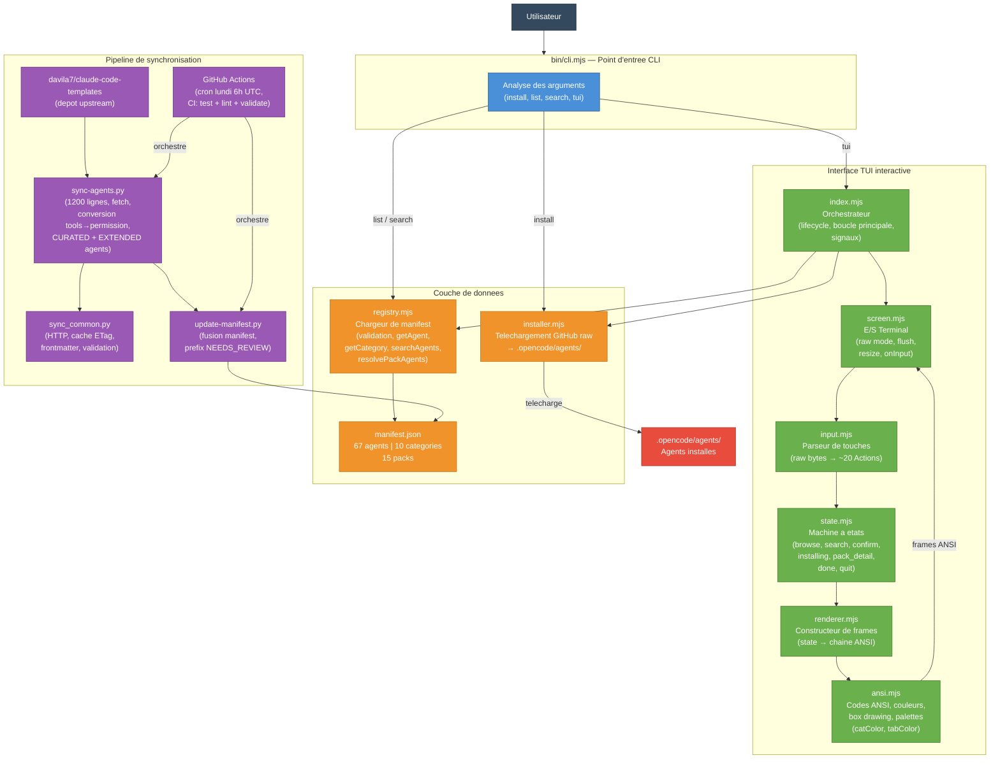
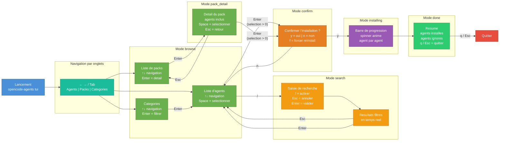

# Architecture du projet OpenCode Template Agent

Ce document presente l'architecture technique du projet a travers trois diagrammes Mermaid.
Le projet est un gestionnaire d'agents pour OpenCode : il permet de parcourir, rechercher et installer
des agents depuis un catalogue (manifest) via une interface TUI interactive ou des commandes CLI directes.

---

## 1. Architecture globale

Ce premier diagramme montre la structure complete du systeme : le point d'entree CLI, les modules TUI,
le registre d'agents et le pipeline de synchronisation depuis le depot upstream.

**Explication :**

- **CLI (`bin/cli.mjs`)** : Point d'entree unique. Parse les arguments et route vers les commandes
  `install`, `list`, `search` ou `tui`.
- **TUI** : Interface interactive construite sur une boucle `input → state → render → screen`.
  L'orchestrateur (`index.mjs`) gere le cycle de vie, les signaux (SIGINT, SIGWINCH) et la boucle
  d'installation. Chaque module a une responsabilite unique.
- **Registre** : `registry.mjs` charge et valide `manifest.json` (67 agents, 10 categories, 15 packs)
  et expose des helpers de requete.
- **Installeur** : `installer.mjs` telecharge les fichiers depuis GitHub raw et les ecrit dans
  `.opencode/agents/`.
- **Synchronisation** : Un pipeline de scripts Python (`sync-agents.py`, `sync_common.py`,
  `update-manifest.py`) orchestre par GitHub Actions maintient le catalogue a jour depuis le depot
  upstream `davila7/claude-code-templates`.

---

## 2. Flux utilisateur TUI

Ce diagramme detaille le parcours utilisateur dans l'interface TUI et les transitions
de la machine a etats.

**Explication :**

- **Navigation par onglets** : Les fleches gauche/droite ou Tab permettent de basculer entre les
  onglets Agents, Packs et Categories.
- **Mode browse** : L'utilisateur parcourt les listes avec les fleches haut/bas. `Space` selectionne
  un agent, `Enter` ouvre le detail d'un pack ou filtre par categorie.
- **Mode search** : Active avec `/`, la recherche filtre en temps reel. `Esc` annule, `Enter` valide.
- **Mode pack_detail** : Affiche les agents d'un pack. `Space` selectionne individuellement,
  `Esc` retourne a la liste des packs.
- **Mode confirm** : Avant l'installation, une confirmation est demandee. `y` lance l'installation,
  `n` annule, `f` force la reinstallation des agents deja presents.
- **Mode installing** : Une barre de progression avec spinner anime montre l'avancement agent par agent.
- **Mode done** : Resume final avec le nombre d'agents installes et ignores. `q` ou `Esc` pour quitter.

---

## 3. Pipeline de mise a jour des agents

Ce diagramme detaille le pipeline de synchronisation orchestre par GitHub Actions
qui maintient le catalogue a jour depuis le depot upstream.

```mermaid
flowchart TB
    subgraph Trigger["Declenchement"]
        Cron["Cron hebdomadaire<br/>Lundi 6h UTC"]
        Manual["Dispatch manuel<br/>tier: core/extended/all<br/>force: true/false<br/>dry_run: true/false"]
    end

    subgraph Pipeline["Pipeline GitHub Actions — 10 etapes"]
        Step1["1. Checkout<br/>actions/checkout@v4"]
        Step2["2. Setup Python 3.12<br/>actions/setup-python@v5"]
        Step3["3. Snapshot pre-sync<br/>Sauvegarde etat courant<br/>de agents/"]
        Step4["4. sync-agents.py<br/>Fetch upstream<br/>davila7/claude-code-templates"]

        subgraph SyncDetail["Details sync-agents.py"]
            Fetch["Telecharge les agents<br/>depuis le depot upstream"]
            Convert["Conversion tools: → permission:<br/>dans le frontmatter"]
            Curated["CURATED_AGENTS dict<br/>Agents verifies manuellement"]
            Extended["EXTENDED_AGENTS dict<br/>Agents supplementaires"]
            WriteFiles["Ecriture<br/>agents/*.md<br/>agents/manifest.json"]
        end

        Step5["5. Detecter changements<br/>Nouveaux | Modifies | Supprimes"]
        Step6["6. update-manifest.py<br/>Fusion dans manifest.json racine"]

        subgraph ManifestDetail["Details update-manifest.py"]
            Merge["Fusion sync manifest<br/>→ root manifest.json"]
            Review["Prefix NEEDS_REVIEW<br/>pour nouveaux agents"]
            Stale["Detection agents obsoletes<br/>(supprimes upstream)"]
        end

        Step7["7. Validation<br/>Tests Python + Node<br/>Frontmatter valide<br/>Manifest coherent<br/>Pas de tools: deprecie"]
        Step8["8. Commit<br/>sur branche<br/>sync/agents-latest"]
        Step9["9. Force-push<br/>vers origin"]
        Step10["10. Creer / Mettre a jour PR<br/>Description detaillee<br/>avec liste des changements"]
    end

    subgraph Security["Securite"]
        Unknown["UNKNOWN_PERMISSIONS<br/>pour agents non curates"]
        PathCheck["Protection traversee<br/>de chemin (path validation)"]
        SHA["Actions epinglees par SHA<br/>(pas de tags mutables)"]
        Cache["Cache HTTP<br/>ETag / If-Modified-Since<br/>(sync_common.py)"]
    end

    PR["Pull Request<br/>sync/agents-latest → main"]

    Cron --> Step1
    Manual --> Step1
    Step1 --> Step2
    Step2 --> Step3
    Step3 --> Step4
    Step4 --> Fetch
    Fetch --> Convert
    Convert --> Curated
    Convert --> Extended
    Curated --> WriteFiles
    Extended --> WriteFiles
    WriteFiles --> Step5
    Step5 --> Step6
    Step6 --> Merge
    Merge --> Review
    Merge --> Stale
    Review --> Step7
    Stale --> Step7
    Step7 --> Step8
    Step8 --> Step9
    Step9 --> Step10
    Step10 --> PR

    Security -.->|"applique a"| Step4
    Security -.->|"applique a"| Step6
    Security -.->|"applique a"| Step1

    classDef trigger fill:#4a90d9,stroke:#2c5f8a,color:#fff
    classDef step fill:#6ab04c,stroke:#3d7a28,color:#fff
    classDef detail fill:#1abc9c,stroke:#148f77,color:#fff
    classDef security fill:#e74c3c,stroke:#a93226,color:#fff
    classDef output fill:#9b59b6,stroke:#6c3483,color:#fff

    class Cron,Manual trigger
    class Step1,Step2,Step3,Step4,Step5,Step6,Step7,Step8,Step9,Step10 step
    class Fetch,Convert,Curated,Extended,WriteFiles,Merge,Review,Stale detail
    class Unknown,PathCheck,SHA,Cache security
    class PR output
```

**Explication :**

- **Declenchement** : Le pipeline s'execute automatiquement chaque lundi a 6h UTC via un cron,
  ou manuellement via `workflow_dispatch` avec des parametres (`tier`, `force`, `dry_run`).
- **Synchronisation** : `sync-agents.py` (environ 1200 lignes) telecharge les agents depuis
  `davila7/claude-code-templates`, convertit les champs `tools:` deprecies en `permission:`,
  et ecrit les fichiers dans `agents/`. Il distingue les agents curates (verifies
  manuellement, dictionnaire `CURATED_AGENTS`) des agents etendus (`EXTENDED_AGENTS`).
- **Mise a jour du manifest** : `update-manifest.py` fusionne le manifest de synchronisation dans
  le `manifest.json` racine. Les nouveaux agents recoivent le prefix `[NEEDS_REVIEW]` pour
  signaler qu'ils necessitent une verification manuelle. Les agents supprimes upstream sont detectes
  comme obsoletes.
- **Validation** : Avant le commit, le pipeline verifie les tests (Python + Node), la validite du
  frontmatter, la coherence du manifest, et l'absence de champs `tools:` deprecies.
- **Securite** : Les agents non curates recoivent `UNKNOWN_PERMISSIONS`, les chemins sont valides
  contre la traversee de repertoire, les actions GitHub sont epinglees par SHA (pas de tags mutables),
  et le cache HTTP (ETag, If-Modified-Since) via `sync_common.py` reduit les appels reseau.
- **Livraison** : Le pipeline commit sur la branche `sync/agents-latest`, force-push vers origin,
  et cree ou met a jour une Pull Request avec une description detaillee des changements.
