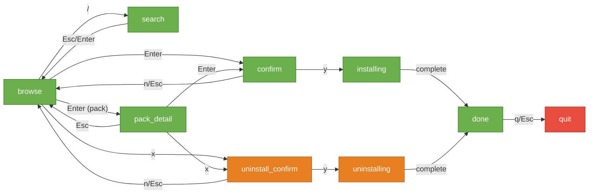

# Design: Pack Installation Fix & Agent Uninstall

This document describes two UX improvements to opencode-template-agent:
1. **Pack installation fix** — pressing Enter in pack_detail installs all agents when none are manually selected
2. **Agent uninstall** — new capability to remove installed agents via TUI and CLI

---

## 1. Pack Installation Fix

### Problem

In `src/tui/state.mjs`, the `updatePackDetail()` reducer handles `Action.CONFIRM` (Enter key) as follows:

```js
case Action.CONFIRM: {
  if (state.selection.size === 0) return state; // ← BUG: no-op
  // ...proceeds to confirm mode
}
```

**Expected behavior:** Pressing Enter in pack_detail should install all agents in the pack (or all uninstalled agents) when nothing is manually selected — matching the browse mode pattern where Enter auto-selects the cursor item.

**Actual behavior:** Nothing happens. User must press `a` (select all) then Enter — a non-discoverable two-step process.

### Solution

When `selection.size === 0` and user presses Enter in pack_detail mode:
1. Auto-select all **uninstalled** agents in the pack
2. If all agents are already installed, show a flash message
3. Proceed to confirm mode with pack context for a better confirmation message

### State Shape Changes

Add `confirmContext` to initial state:

```js
// In createInitialState()
confirmContext: null  // { type: 'pack'|'agents', label: string|null }
```

### State Machine Change — `updatePackDetail()`

```js
case Action.CONFIRM: {
  let sel = state.selection;
  if (sel.size === 0) {
    const uninstalled = state.packDetail.agents
      .filter(a => !state.installed.has(a.name));
    if (uninstalled.length === 0) {
      return { ...state, flash: 'All agents in this pack are already installed' };
    }
    sel = new Set(uninstalled.map(a => a.name));
  }
  return {
    ...state,
    mode: 'confirm',
    selection: sel,
    confirmContext: {
      type: 'pack',
      label: state.packDetail.label
    }
  };
}
```

### Renderer Change — `renderConfirm()`

```
// Current message:
  "Install 8 agent(s)?"

// New message (when confirmContext.type === 'pack'):
  "Install pack 'Backend Essentials' (8 agents)?"

// Default message (no context / type === 'agents'):
  "Install 8 agent(s)?"
```

### Edge Cases

| Scenario | Behavior |
|---|---|
| No agents selected, some uninstalled | Auto-select all uninstalled → confirm |
| No agents selected, ALL installed | Flash: "All agents in this pack are already installed" |
| Some agents manually selected | Use manual selection (existing behavior) |
| Empty pack (0 agents) | Should not occur — manifest validation prevents it |

### TUI Mockup — Pack Detail (improved)

```
┌──────────────────────────────────────────────────────┐
│  Agents │ ◆ Packs │ Categories                       │
├──────────────────────────────────────────────────────┤
│                                                      │
│  Pack: Backend Essentials                            │
│  8 agents — Build robust backend services            │
│                                                      │
│  [ ] api-architect             API design expert     │
│  [●] database-architect        installed             │
│  [ ] redis-specialist          Caching & streams     │
│  [ ] postgres-pro              Query optimization    │
│  [ ] golang-pro                Go microservices      │
│  [●] python-pro                installed             │
│  [ ] graphql-architect         Schema federation     │
│  [ ] microservices-architect   Distributed systems   │
│                                                      │
├──────────────────────────────────────────────────────┤
│  Space: toggle  a: all  Enter: install  x: remove    │
│  Esc: back                                           │
└──────────────────────────────────────────────────────┘
```

### TUI Mockup — Pack Confirm Dialog (improved)

```
┌──────────────────────────────────────────────────────┐
│                                                      │
│    Install pack 'Backend Essentials' (6 agents)?     │
│                                                      │
│    2 agents already installed will be skipped.       │
│                                                      │
│    [y] Confirm    [n] Cancel    [f] Force all        │
│                                                      │
└──────────────────────────────────────────────────────┘
```

---

## 2. Agent Uninstall — Overview

### New State Machine Modes

```
                ┌──────────────────────────────────────────────┐
                │            CURRENT (install only)            │
                │                                              │
  browse ──Enter──→ confirm ──y──→ installing ──→ done         │
    │                 │                                        │
    │                └──n/Esc──→ browse                        │
    │                                                          │
    ├──Enter(pack)──→ pack_detail ──Enter──→ confirm           │
    │                     │                                    │
    └──/──→ search ──Esc──→ browse                             │
                └──────────────────────────────────────────────┘

                ┌──────────────────────────────────────────────┐
                │               NEW (+ uninstall)              │
                │                                              │
  browse ──x──→ uninstall_confirm ──y──→ uninstalling ──→ done │
    │                 │                                        │
    │                └──n/Esc──→ browse                        │
    │                                                          │
    ├──Enter(pack)──→ pack_detail ──x──→ uninstall_confirm     │
                └──────────────────────────────────────────────┘
```

### Key Binding: `x` for Uninstall

The `x` key is chosen because:
- Not currently mapped in any mode
- Common UX convention for "remove/delete" (close tabs, remove items)
- Visually distinct from navigation keys
- Works alongside Enter (install) as a natural pair: **Enter = add, x = remove**

### New Action Enum Value

```js
// In src/tui/input.mjs — Action enum
UNINSTALL: 'uninstall'
```

---

## 3. Uninstall — TUI Design

### Flow

1. **Browse/pack_detail mode**: User positions cursor on an installed agent (or selects multiple with Space)
2. **Press `x`**: System computes uninstall targets
   - If selection exists → filter to only installed agents
   - If no selection → use cursor item (only if installed)
   - If no installed agents in targets → flash: "No installed agents selected"
3. **uninstall_confirm mode**: Shows targets and asks for confirmation
4. **Press `y`**: Transitions to `uninstalling` mode, performs file deletions
5. **Done**: Shows removal summary

### State Shape Additions

```js
// In createInitialState()
uninstall: null
// Shape when active:
// {
//   agents: Agent[],      // agents to uninstall
//   current: number,      // index of current agent being removed
//   total: number,        // total count
//   results: Result[],    // { agent, status: 'removed'|'error'|'not-found', error? }
//   done: boolean
// }
```

### Input Mappings — New/Modified

| Mode | Key | Action | Condition |
|---|---|---|---|
| browse | `x` | UNINSTALL | Always available |
| pack_detail | `x` | UNINSTALL | Always available |
| uninstall_confirm | `y` | CONFIRM | — |
| uninstall_confirm | `n` | CANCEL | — |
| uninstall_confirm | `Escape` | CANCEL | — |

### State Machine — `handleBrowse()` UNINSTALL case

```js
case Action.UNINSTALL: {
  let targets;
  if (state.selection.size > 0) {
    // Filter selection to only installed agents
    targets = [...state.selection]
      .filter(name => state.installed.has(name))
      .map(name => state.agents.find(a => a.name === name))
      .filter(Boolean);
  } else {
    // Use cursor item
    const item = state.filteredList[state.cursor];
    if (item && item.type === 'agent' && state.installed.has(item.agent.name)) {
      targets = [item.agent];
    } else {
      targets = [];
    }
  }

  if (targets.length === 0) {
    return { ...state, flash: 'No installed agents selected' };
  }

  return {
    ...state,
    mode: 'uninstall_confirm',
    uninstall: {
      agents: targets,
      current: 0,
      total: targets.length,
      results: [],
      done: false
    }
  };
}
```

### State Machine — `updateUninstallConfirm()`

```js
function updateUninstallConfirm(state, action) {
  switch (action) {
    case Action.CONFIRM:
      return { ...state, mode: 'uninstalling' };
    case Action.CANCEL:
      return {
        ...state,
        mode: 'browse',
        uninstall: null,
        selection: new Set()
      };
    default:
      return state;
  }
}
```

### TUI Orchestrator — `performUninstall()`

In `src/tui/index.mjs`:

```js
async function performUninstall() {
  if (uninstallInProgress) return;
  uninstallInProgress = true;

  const { agents } = currentState.uninstall;

  for (let i = 0; i < agents.length; i++) {
    // Update progress
    currentState = {
      ...currentState,
      uninstall: { ...currentState.uninstall, current: i }
    };
    refresh();

    const result = await uninstallAgent(agents[i], { dest: options.dest });

    currentState = {
      ...currentState,
      uninstall: {
        ...currentState.uninstall,
        current: i + 1,
        results: [...currentState.uninstall.results, result]
      }
    };
    refresh();
  }

  // Refresh installed set
  const installed = await detectInstalled(options.dest);

  currentState = {
    ...currentState,
    mode: 'done',
    installed,
    uninstall: { ...currentState.uninstall, done: true },
    selection: new Set()
  };

  uninstallInProgress = false;
  refresh();
}
```

### TUI Mockup — Uninstall Confirm

```
┌──────────────────────────────────────────────────────┐
│                                                      │
│    ⚠  Remove 3 agent(s)?                            │
│                                                      │
│    This will delete the following files from          │
│    .opencode/agents/:                                │
│                                                      │
│     • api-architect.md                               │
│     • database-architect.md                          │
│     • redis-specialist.md                            │
│                                                      │
│    [y] Confirm    [n] Cancel                         │
│                                                      │
└──────────────────────────────────────────────────────┘
```

### TUI Mockup — Uninstalling Progress

```
┌──────────────────────────────────────────────────────┐
│                                                      │
│    Removing agents... (2/3)                          │
│                                                      │
│    ✔ api-architect             removed               │
│    ✔ database-architect        removed               │
│    ⏳ redis-specialist          removing...           │
│                                                      │
└──────────────────────────────────────────────────────┘
```

### TUI Mockup — Uninstall Done

```
┌──────────────────────────────────────────────────────┐
│                                                      │
│    ✔ Removed 3 agent(s) successfully                 │
│                                                      │
│    ✔ api-architect             removed               │
│    ✔ database-architect        removed               │
│    ✔ redis-specialist          removed               │
│                                                      │
│    Press any key to continue                         │
│                                                      │
└──────────────────────────────────────────────────────┘
```

### Footer Hints Update

```
// browse mode (agents tab) — updated footer:
  ↑↓: navigate  Space: select  Enter: install  x: remove  /: search  q: quit

// pack_detail mode — updated footer:
  Space: toggle  a: all  Enter: install  x: remove  Esc: back
```

The `x: remove` hint is **always shown** (not conditional on installed state) to maintain discoverability. If the user presses `x` with no installed agents targeted, they get a non-blocking flash message.

---

## 4. Uninstall — CLI Design

### Command Syntax

```
opencode-agents uninstall <agent-name> [<agent-name> ...]
opencode-agents uninstall --pack <pack-id> [--pack <pack-id> ...]
opencode-agents uninstall --category <category-id> [--category <category-id> ...]
opencode-agents uninstall --all
opencode-agents uninstall --dry-run
opencode-agents uninstall --force
```

### Flags

| Flag | Short | Description |
|---|---|---|
| `--pack <id>` | `-p` | Remove all installed agents in the specified pack(s) |
| `--category <id>` | `-c` | Remove all installed agents in the specified category/categories |
| `--all` | `-a` | Remove ALL installed agents |
| `--dry-run` | `-d` | Preview what would be removed without deleting |
| `--force` | `-f` | Skip confirmation prompt |

### CLI Flow

```
1. Parse arguments → resolve target agents
2. Filter to only installed agents (check file existence)
3. If none installed → print "No installed agents match" → exit 0
4. If --dry-run → print "Would remove:" + agent list → exit 0
5. If not --force → prompt "Remove N agent(s)? [y/N]" (readline)
6. Perform uninstall (call uninstallAgents())
7. Print results using display helpers
8. Print summary line
```

### CLI Output Examples

**Single agent:**
```
$ opencode-agents uninstall api-architect
Remove 1 agent? [y/N] y
  ✔ Removed api-architect
```

**Pack with dry-run:**
```
$ opencode-agents uninstall --pack backend-essentials --dry-run
Would remove 5 agent(s):
  • api-architect
  • database-architect
  • redis-specialist
  • postgres-pro
  • golang-pro
(3 agents in pack are not installed, skipped)
```

**Force remove all:**
```
$ opencode-agents uninstall --all --force
  ✔ Removed api-architect
  ✔ Removed database-architect
  ✔ Removed python-pro
  ...
Removed 12 agent(s).
```

**Nothing to remove:**
```
$ opencode-agents uninstall api-architect
  ⚠ api-architect is not installed.
Nothing to remove.
```

### Help Text Addition

```
Commands:
  install    Install agents from the registry
  uninstall  Remove installed agents
  list       List available agents and packs
  search     Search agents by keyword
  tui        Launch interactive terminal UI

Uninstall options:
  -p, --pack <id>       Remove agents from a pack
  -c, --category <id>   Remove agents from a category
  -a, --all             Remove all installed agents
  -d, --dry-run         Preview without removing
  -f, --force           Skip confirmation prompt
```

---

## 5. Installer Module — Uninstall Functions

### `uninstallAgent(agent, options)`

```js
import { promises as fs } from 'node:fs';
import path from 'node:path';

export async function uninstallAgent(agent, options = {}) {
  const dest = getDestination(agent, options);
  // Security: getDestination() already validates path traversal

  if (options.dryRun) {
    return { agent: agent.name, status: 'dry-run', path: dest };
  }

  try {
    await fs.unlink(dest);

    // Clean up empty parent directory (category folder)
    const dir = path.dirname(dest);
    try {
      const entries = await fs.readdir(dir);
      if (entries.length === 0) {
        await fs.rmdir(dir);
      }
    } catch {
      // Ignore — directory may have other files or may not exist
    }

    return { agent: agent.name, status: 'removed', path: dest };
  } catch (err) {
    if (err.code === 'ENOENT') {
      return { agent: agent.name, status: 'not-found' };
    }
    return { agent: agent.name, status: 'error', error: err.message };
  }
}
```

### `uninstallAgents(agents, options)`

```js
export async function uninstallAgents(agents, options = {}) {
  const results = [];
  for (const agent of agents) {
    const result = await uninstallAgent(agent, options);
    if (options.onProgress) {
      options.onProgress(result, results.length + 1, agents.length);
    }
    results.push(result);
  }
  return results;
}
```

### Security Considerations

- **Path traversal**: Reuses existing `getDestination()` which validates that the resolved path stays within the target directory
- **ENOENT handling**: Graceful — returns `not-found` status instead of throwing
- **Empty dir cleanup**: Only removes the immediate parent directory if empty; uses `rmdir` (not `rm -rf`) which fails safely if directory is not empty
- **No recursive delete**: Only removes the single agent file, never directories with contents

---

## 6. Display Module — Uninstall Output Helpers

### New Functions in `src/display.mjs`

```js
export function uninstallSuccess(result) {
  console.log(`  ${green('✔')} Removed ${bold(result.agent)}`);
}

export function uninstallNotFound(result) {
  console.log(`  ${yellow('⚠')} ${result.agent} is not installed.`);
}

export function uninstallError(result) {
  console.log(`  ${red('✗')} Error removing ${bold(result.agent)}: ${result.error}`);
}

export function uninstallSummary(results) {
  const removed = results.filter(r => r.status === 'removed').length;
  const notFound = results.filter(r => r.status === 'not-found').length;
  const errors = results.filter(r => r.status === 'error').length;

  const parts = [];
  if (removed > 0) parts.push(`Removed ${removed} agent(s)`);
  if (notFound > 0) parts.push(`${notFound} not installed`);
  if (errors > 0) parts.push(`${errors} error(s)`);

  console.log(parts.join(', ') + '.');
}

export function uninstallDryRun(agents) {
  console.log(`Would remove ${agents.length} agent(s):`);
  for (const agent of agents) {
    console.log(`  • ${agent.name}`);
  }
}
```

---

## 7. Accessibility

### Color-Blind Friendly Design

All status indicators use **both** a symbol AND a text label:

| Status | Symbol | Text | Color |
|---|---|---|---|
| Installed | `●` | "installed" | Green |
| Selected | `[✔]` | — | Blue/Cyan |
| Removed | `✔` | "removed" | Green |
| Error | `✗` | "error: ..." | Red |
| Not found | `⚠` | "not installed" | Yellow |
| In progress | `⏳` | "removing..." | Dim |

### `NO_COLOR` Support

The existing `NO_COLOR` environment variable support in `ansi.mjs` applies to all new rendering. When `NO_COLOR` is set:
- All ANSI color codes are stripped
- Text labels become the sole status indicators
- Box drawing characters are preserved (they're Unicode, not ANSI)

---

## 8. Updated Architecture Diagram

### Mode Transitions (complete)



---

## 9. File Change Summary

| File | Type | Changes |
|---|---|---|
| `src/tui/state.mjs` | Modify | Add `confirmContext`, `uninstall` to initial state; fix pack CONFIRM; add UNINSTALL handler in browse + pack_detail; new `updateUninstallConfirm()` reducer; new `uninstalling` mode in `update()` |
| `src/tui/input.mjs` | Modify | Add `Action.UNINSTALL`; map `x` in browse + pack_detail modes; add `uninstall_confirm` mode key mappings |
| `src/tui/renderer.mjs` | Modify | Update `renderConfirm()` for pack context; new `renderUninstallConfirm()`; new `renderUninstalling()`; update `render()` switch; update footer hints |
| `src/tui/index.mjs` | Modify | Add `performUninstall()` async function; wire `uninstalling` mode trigger |
| `src/installer.mjs` | Modify | Add `uninstallAgent()` and `uninstallAgents()` exports |
| `src/display.mjs` | Modify | Add `uninstallSuccess()`, `uninstallNotFound()`, `uninstallError()`, `uninstallSummary()`, `uninstallDryRun()` |
| `bin/cli.mjs` | Modify | Add `uninstall` command with flag parsing; add `runUninstall()` function; update help text |
| `tests/tui.test.mjs` | Modify | Add tests for pack auto-select, UNINSTALL action, uninstall_confirm transitions, edge cases |
| `tests/cli.test.mjs` | Modify | Add tests for uninstall command, --dry-run, --pack, --category, --all, error cases |

### Estimated Scope

- ~9 files modified
- ~400-500 lines added
- 0 dependencies added
- All 250+ existing tests continue to pass
- Pure functional architecture preserved (state machine + renderer remain pure)

---

## 10. Implementation Order

1. **`src/installer.mjs`** — Add `uninstallAgent()` and `uninstallAgents()` (isolated, testable)
2. **`src/display.mjs`** — Add CLI display helpers (isolated, testable)
3. **`src/tui/input.mjs`** — Add `Action.UNINSTALL` and key mappings (small change)
4. **`src/tui/state.mjs`** — Pack install fix + uninstall state machine (core logic)
5. **`src/tui/renderer.mjs`** — New render functions and updated footer (visual layer)
6. **`src/tui/index.mjs`** — Wire `performUninstall()` (orchestration)
7. **`bin/cli.mjs`** — Add `uninstall` command (CLI entry point)
8. **`tests/tui.test.mjs`** — Test pack fix + uninstall TUI flows
9. **`tests/cli.test.mjs`** — Test uninstall CLI flows

Each step is independently committable and testable.
